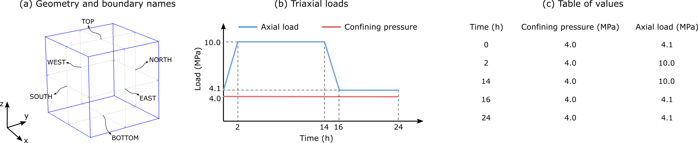
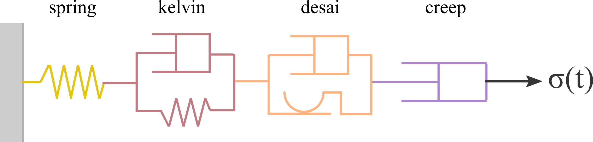

# Triaxial test

## Goals


1. Define time-dependent boundary conditions
2. Define constitutive model
3. Save custom fields

## Problem description
This example simulates the mechanical behavior of a cubic-shaped salt sample under triaxial conditions. The geometry and boundary names are shown in [](#fig-cube-geom)-a. Faces WEST, SOUTH, and BOTTOM are prevented from normal displacement (i.e., Dirichlet boundary condition). Faces NORTH and EAST are subjected to a constant confining pressure of 4 MPa, while a time-dependent axial load is applied on the TOP boundary, according to [](#fig-cube-geom)-b.

{#fig-cube-geom width="100%"}

As illustrated in [](#fig-cube-model), the constitutive model consists of an elastic element (spring), a viscoelastic (kelvin) element, a viscoplastic (desai) element, and a dislocation creep (creep) element.

{#fig-cube-model width="60%"}


## Implementation

Import relevant packages. Note that the only reason to import package *dolfinx* here is to initialize the custom fields to be saved during the simulation, as explained next.

```Python
import os
import dolfinx as do
import torch as to
from petsc4py import PETSc
import safeincave as sf
import safeincave.Utils as ut
import safeincave.MomentumBC as momBC
```

As stated in the beginning, one of the goals in this example is to save custom fields, namely viscoelastic strains (**eps_ve**), dislocation creep strains (**eps_cr**), viscoplastic strains (**eps_vp**), and the yield function values (**Fvp**). All of these quantities are evaluated at the element centroids (i.e., quadrature points). The mentioned strains are 2nd order tensor fields (i.e., 3x3 matrices), and **Fvp** is a scalar field. These fields are not originally available in class **LinearMomentum**, so we derive a class **LinearMomentumMod** from **LinearMomentum**, and include the desired fields. These fields are initialized inside the method **initialize** below. Notice that **Fvp** is a piecewise constant Discotinuous Galerkin scalar field, denoted as *DG0_1*, while the strains are initialized as Discontinuous Galerkin matrix (rank-2 tensor) field, denoted as *DG0_3x3*. The second method in **LinearMomentumMod**, **run_after_solve** is executed at the end of each time step of the simulation, and is responsible to retrieve the desired fields from the constitutive model object *mat* and assign them to appropriate Dolfinx structures, that is, **Fvp**, **eps_ve**, **eps_cr**, eps_vp**.

```Python
class LinearMomentumMod(sf.LinearMomentum):
	def __init__(self, grid, theta):
		super().__init__(grid, theta)

	def initialize(self) -> None:
		self.C.x.array[:] = to.flatten(self.mat.C)
		self.Fvp = do.fem.Function(self.DG0_1)
		self.eps_ve = do.fem.Function(self.DG0_3x3)
		self.eps_cr = do.fem.Function(self.DG0_3x3)
		self.eps_vp = do.fem.Function(self.DG0_3x3)

	def run_after_solve(self):
		self.eps_ve.x.array[:] = to.flatten(self.mat.elems_ne[0].eps_ne_k)
		self.eps_cr.x.array[:] = to.flatten(self.mat.elems_ne[1].eps_ne_k)
		self.eps_vp.x.array[:] = to.flatten(self.mat.elems_ne[2].eps_ne_k)
		self.Fvp.x.array[:] = self.mat.elems_ne[2].Fvp
```

The lines below define the location of the mesh and creates the **GridHandlerGMSH** object.

```Python
grid_path = os.path.join("..", "..", "..", "grids", "cube")
grid = sf.GridHandlerGMSH("geom", grid_path)
```

Defnies the output folder name, where the results will be saved.

```Python
output_folder = os.path.join("output", "case_0")
```

Creates a **TimeController** object, responsible for advancing time and stop the simulation when final time is reached. The **TimeController** class creates an equally spaced time discretization with, in this case, a time step size of 0.5 hour and a final time of 24 hours.

```Python
t_control = sf.TimeController(dt=0.5, initial_time=0.0, final_time=24, time_unit="hour")
```

Instantiate object of the derived class **LinearMomentumMod**, choosing Crank-Nicolson" + r" ($\theta=0.5$) as a time integration scheme.

```Python
mom_eq = LinearMomentumMod(grid, theta=0.5)
```

Define the linear system solver using PETSc. In this case, we choose Conjugate Gradient (*cg*) and Additive Schwartz Method (*asm*) as a preconditioner.

```Python
mom_solver = PETSc.KSP().create(grid.mesh.comm)
mom_solver.setType("cg")
mom_solver.getPC().setType("asm")
mom_solver.setTolerances(rtol=1e-12, max_it=100)
mom_eq.set_solver(mom_solver)
```

Initialize the constitutive model based on the number of elements (quadrature points) of the mesh.

```Python
mat = sf.Material(mom_eq.n_elems)
```

We assign the same value of 2000 kg$/$m$^3$ to all elements of the mesh.

```Python
rho = 2000.0*to.ones(mom_eq.n_elems, dtype=to.float64)
mat.set_density(rho)
```

Initialize *spring* by assigning a homogeneous distribution of Young's modulus" + r" ($E$) and Poisson's ratio ($\nu$).

```Python
E = 102e9*to.ones(mom_eq.n_elems)
nu = 0.3*to.ones(mom_eq.n_elems)
spring_0 = sf.Spring(E, nu, "spring")
```

Initialize the viscoelastic element by defining constant values of $E$, $\nu$, and $\eta$.

```Python
eta = 105e11*to.ones(mom_eq.n_elems)
E = 10e9*to.ones(mom_eq.n_elems)
nu = 0.32*to.ones(mom_eq.n_elems)
kelvin = sf.Viscoelastic(eta, E, nu, "kelvin")
```

Define dislocation creep element.

```Python
A = 1.9e-20*to.ones(mom_eq.n_elems)
Q = 51600*to.ones(mom_eq.n_elems)
n = 3.0*to.ones(mom_eq.n_elems)
creep_0 = sf.DislocationCreep(A, Q, n, "creep")
```

Define the viscoplastic element.

```Python
mu_1 = 5.3665857009859815e-11*to.ones(mom_eq.n_elems)
N_1 = 3.1*to.ones(mom_eq.n_elems)
n = 3.0*to.ones(mom_eq.n_elems)
a_1 = 1.965018496922832e-05*to.ones(mom_eq.n_elems)
eta = 0.8275682807874163*to.ones(mom_eq.n_elems)
beta_1 = 0.0048*to.ones(mom_eq.n_elems)
beta = 0.995*to.ones(mom_eq.n_elems)
m = -0.5*to.ones(mom_eq.n_elems)
gamma = 0.095*to.ones(mom_eq.n_elems)
alpha_0 = 0.0022*to.ones(mom_eq.n_elems)
sigma_t = 5.0*to.ones(mom_eq.n_elems)
desai = sf.ViscoplasticDesai(mu_1, N_1, a_1, eta, n, beta_1, beta, m, gamma, sigma_t, alpha_0, "desai")
```

Add the above defined elements to the **Material** object *mat*.

```Python
mat.add_to_elastic(spring_0)
mat.add_to_non_elastic(kelvin)
mat.add_to_non_elastic(creep_0)
mat.add_to_non_elastic(desai)
```

Once the material is defined, which includes the constitutive model, we assign it to the linear momentum balance equation.

```Python
mom_eq.set_material(mat)
```

Next, we define the gravity acceleration vector for body force calculation. Since we want to disregard body forces, we choose zero gravity acceleration.

```Python
g_vec = [0.0, 0.0, 0.0]
mom_eq.build_body_force(g_vec)
```

Assign a uniform temperature distribution of 293 K throughout the domain.

```Python
T0_field = 293*to.ones(mom_eq.n_elems)
mom_eq.set_T0(T0_field)
mom_eq.set_T(T0_field)
```

Apply Dirichlet boundary conditions to faces WEST, BOTTOM, and SOUTH. Notice that face WEST is align with the $x$ direction, so the component $x$ of the displacement vector (*component=0*) is imposed to be 0" + " since the initial time 0.0 until the final time t_control.t_final, which stores the value 24 hours." + r" Similarly, face BOTTOM is aligned with the $z$ direction, hence *component=2*, and face SOUTH is aligned with the $y$ direction, hence *component=1*.

```Python
bc_west = momBC.DirichletBC(boundary_name = "WEST", 
			 		component = 0,
					values = [0.0, 0.0],
					time_values = [0.0, t_control.t_final])
bc_bottom = momBC.DirichletBC(boundary_name = "BOTTOM", 
					component = 2,
					values = [0.0, 0.0],
					time_values = [0.0, t_control.t_final])
bc_south = momBC.DirichletBC(boundary_name = "SOUTH", 
					component = 1,
					values = [0.0, 0.0],
					time_values = [0.0, t_control.t_final])
```

The constant confining pressure of 4.0 MPa, as illustrated in Fig. {fig_1_cube_geom}-b, is imposed on faces EAST and NORTH. The confining pressure is uniform over these boundaries, so the input *density* in class **NeumannBC** must be zero. As a result, the inputs *direction* and *res_pos* are irrelevant. Finally, inputs *values* and *time_values* inform that between times 0 and 24 hours (t_control.t_final), the imposed load is constant and equal to 4.0 MPa. 

```Python
bc_east = momBC.NeumannBC(boundary_name = "EAST",
					direction = 2,
					density = 0.0,
					ref_pos = 0.0,
					values =      [4.0*ut.MPa, 4.0*ut.MPa],
					time_values = [0.0, t_control.t_final],
					g = g_vec[2])
bc_north = momBC.NeumannBC(boundary_name = "NORTH",
					direction = 2,
					density = 0.0,
					ref_pos = 0.0,
					values =      [4.0*ut.MPa, 4.0*ut.MPa],
					time_values = [0.0, t_control.t_final],
					g = g_vec[2])
```

The same comments from the previous paragraph are valid for the TOP boundary. However, in this case, the axial load follows the values shown in the table of Fig. [](#fig-cube-geom)-c.

```Python
bc_top = momBC.NeumannBC(boundary_name = "TOP",
					direction = 2,
					density = 0.0,
					ref_pos = 0.0,
					values =      [4.1*ut.MPa, 16*ut.MPa, 16*ut.MPa,  6*ut.MPa,   6*ut.MPa],
					time_values = [0*ut.hour,  2*ut.hour, 14*ut.hour, 16*ut.hour, 24*ut.hour],
					g = g_vec[2])
```

Once the boundary condition objects are created, add them to the **BcHandler** object and set it to the momentum balance equation object *mom_eq*.

```Python
bc_handler = momBC.BcHandler(mom_eq)
bc_handler.add_boundary_condition(bc_west)
bc_handler.add_boundary_condition(bc_bottom)
bc_handler.add_boundary_condition(bc_south)
bc_handler.add_boundary_condition(bc_east)
bc_handler.add_boundary_condition(bc_north)
bc_handler.add_boundary_condition(bc_top)
mom_eq.set_boundary_conditions(bc_handler)
```

Initialize the **SaveFields** object, set the output folder, where the results are saved, and inform which fields to be saved. Notice that the string informed in the first argument in function *add_output_field* must be an attribute of *mom_eq*, that's why we had to create class **LinearMomentumMod** in the beginning of this tutorial. The second argument is a user-defined name to be assigned to the field.

```Python
output_mom = sf.SaveFields(mom_eq)
output_mom.set_output_folder(output_folder)
output_mom.add_output_field("u", "Displacement (m)")
output_mom.add_output_field("eps_tot", "Total strain (-)")
output_mom.add_output_field("eps_ve", "Viscoelastic strain (-)")
output_mom.add_output_field("eps_cr", "Creep strain (-)")
output_mom.add_output_field("eps_vp", "Viscoplastic strain (-)")
output_mom.add_output_field("Fvp", "Yield function (-)")
outputs = [output_mom]
```

Finally, pass the linear momentum equation object, the time controller, and the output list as arguments to the mechanical simulator **Simulator_M**. The last argument informs the simulator to solve the initial elastic response before the transient simulation begins.

```Python
sim = sf.Simulator_M(mom_eq, t_control, outputs, compute_elastic_response=True)
sim.run()
```