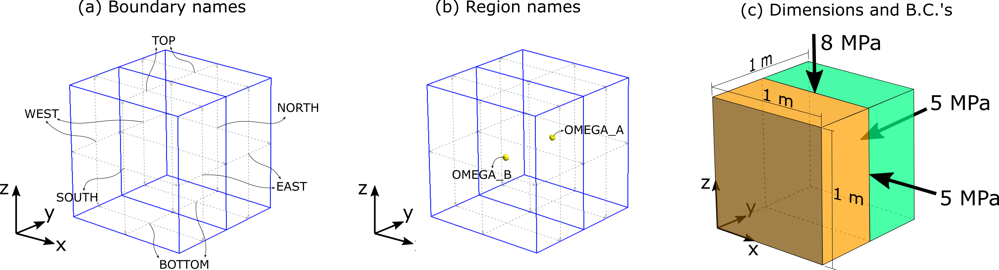
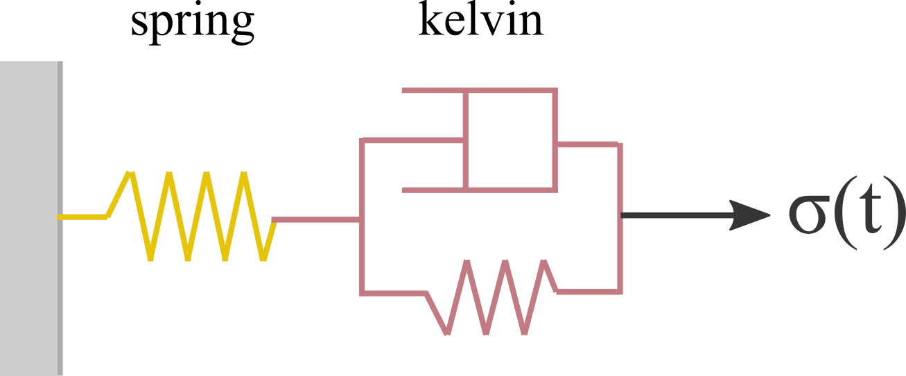

# Cube with 2 regions

## Goal:

1. Define material properties in different regions

## Problem description

This problem consists of a cube divided in two regions: OMEGA_A and OMEGA_B, as illustrated in [](#fig-cube-geom). The cube is subjected to a constant confining pressure of 5 MPa on faces EAST and NORTH, and a constant axial stress of 8 MPa on face TOP. The remaining faces are prevented from normal displacements.

{#fig-cube-geom width="100%"}

As illustrated in [](#fig-cube-model), the constitutive model consists of an elastic element (spring) and a viscoelastic (kelvin) element. Different values for the material properties of these two elements are assigned to the two regions of the domain, as indicated in the table of [](#fig-cube-model).

{#fig-cube-model width="40%"}


## Implementation

As usual, import relevant packages.

```Python
from safeincave import *
import safeincave.Utils as ut
import safeincave.MomentumBC as momBC
from petsc4py import PETSc
import torch as to
import os
import time
```


Define grid path and create grid object.

```Python
grid_path = os.path.join("..", "..", "..", "grids", "cube_regions")
grid = GridHandlerGMSH("geom", grid_path)
```

Define output folder where the simulation results will be saved.

```Python
output_folder = os.path.join("output", "case_0")
```

Create an equally spaced time discretization with time step size of 0.01 hour and final time of 1.0 hour. For this purpose, we use class **TimeController**.

```Python
t_control = TimeController(dt=0.01, initial_time=0.0, final_time=1.0, time_unit="hour")
```

Initialize object for the momentum balance equation (**LinearMomentum**) and choose Crank-Nicolson as a time integration scheme ($\theta=0.5$).

```Python
mom_eq = LinearMomentum(grid, theta=0.5)
```

Define solver for momentum balance equation. Choose Conjugate Gradient as a linear solver with Additive Schwartz preconditioner.

> **Note:**: The reason we use Additive Schwartz Method here is because it works well in series and parallel. For instance, incomplete LU factorization (ILU) works well with serial computations, but not in parallel.

```Python
mom_solver = PETSc.KSP().create(grid.mesh.comm)
mom_solver.setType("bicg")
mom_solver.getPC().setType("asm")
mom_solver.setTolerances(rtol=1e-12, max_it=100)
```

Set solver to momentum equation object.

```Python
mom_eq.set_solver(mom_solver)
```

Initialize **Material** object, which contains all material properties and the constitutive model.

```Python
mat = Material(mom_eq.n_elems)
```

Define and set zero density to eliminate body forces effect.

```Python
rho = 0.0*to.ones(mom_eq.n_elems, dtype=to.float64)
mat.set_density(rho)
```

Extract lists of indices belonging to regions OMEGA_A and OMEGA_B. Notice that attribute *region_indices* is a dictionary with as many keys as the number of regions in the mesh.

```Python
omega_A = grid.region_indices["OMEGA_A"]
omega_B = grid.region_indices["OMEGA_B"]
```

Create spring element. First, create a vector of zeros for property $E_0$, and then assign 8 GPa to all elements in OMEGA_A, and 10 GPa to elements in OMEGA_B. Do the same for Poisson's ratio, $\nu_0$. Finally, pass these arguments to class **Spring**, together with a given name '*spring*'.

```Python
E0 = to.zeros(mom_eq.n_elems)
E0[omega_A] = 8*ut.GPa
E0[omega_B] = 10*ut.GPa
nu0 = to.zeros(mom_eq.n_elems)
nu0[omega_A] = 0.2
nu0[omega_B] = 0.3
spring_0 = Spring(E0, nu0, "spring")
```

Create the viscoelastic (i.e., Kelvin-Voigt) element. Assign different values for $\eta_1$, $E_1$, and $\nu_1$ to regions OMEGA_A and OMEGA_B according to the table in" + f" Fig. {fig_2_cube_region_model}.

```Python
eta = to.zeros(mom_eq.n_elems)
eta[omega_A] = 105e11
eta[omega_B] = 38e11
E1 = to.zeros(mom_eq.n_elems)
E1[omega_A] = 8*ut.GPa
E1[omega_B] = 5*ut.GPa
nu1 = to.zeros(mom_eq.n_elems)
nu1[omega_A] = 0.35
nu1[omega_B] = 0.28
kelvin = Viscoelastic(eta, E1, nu1, "kelvin")
```

Add element *spring* to the elastic list of the material *mat*, and add element *kelvin* to the list of non-elastic elements of *mat*.

```Python
mat.add_to_elastic(spring_0)
mat.add_to_non_elastic(kelvin)
```

Now that the material is completely defined, set it to the momentum equation object.

```Python
mom_eq.set_material(mat)
```

Define gravity acceleration vector and assign it to *mom_eq* so it builds the body force terms.

```Python
g = -9.81
g_vec = [0.0, 0.0, g]
mom_eq.build_body_force(g_vec)
```

Define an uniform temperature field of 298 K and assign it to both initial and current temperature.

>**Note:** For the constitutive model adopted in this example, the temperature field is not particularly important, since neither the spring nor the Kelvin-Voigt elements depend on it. In this manner, it's not really necessary to specify temperature for this case. However, it is a good practice to always specify temperature, as the user might decide later to include, for example, dislocation creep into the constitutive model. If dislocation (or pressure solution) creep is present but temperature is not specified, the program will consider internally temperature to be zero, which will in practice neutralize the creep effect according to Arrhenius law.

```Python
T0_field = 298*to.ones(mom_eq.n_elems)
mom_eq.set_T0(T0_field)
mom_eq.set_T(T0_field)
```

Impose zero normal displacements (Dirichlet boundary conditions) on faces WEST, SOUTH, and BOTTOM, by specifying displacement components 0 (x), 1 (y), and 2 (z), respectively.

```Python
bc_west = momBC.DirichletBC(boundary_name = "WEST", 
					component = 0,
					values = [0.0, 0.0],
					time_values = [0.0, t_control.t_final])
bc_south = momBC.DirichletBC(boundary_name = "SOUTH", 
					component = 1,
					values = [0.0, 0.0],
					time_values = [0.0, t_control.t_final])
bc_bottom = momBC.DirichletBC(boundary_name = "BOTTOM", 
					component = 2,
					values = [0.0, 0.0],
					time_values = [0.0, t_control.t_final])
```

Impose constant and uniform normal loads (Neumann boundary condition) on faces EAST, NORTH, and TOP.

>**Note:** Because the loads are uniform along the boundary, we specify *density* to be zero. Consequently, the arguments *direction* and *ref_pos* are ignored.

```Python
bc_east = momBC.NeumannBC(boundary_name = "EAST",
					direction = 2,
					density = 0.0,
					ref_pos = 0.0,
					values = [5.0*ut.MPa, 5.0*ut.MPa],
					time_values = [0.0, t_control.t_final],
					g = g_vec[2])
bc_north = momBC.NeumannBC(boundary_name = "NORTH",
					direction = 2,
					density = 0.0,
					ref_pos = 0.0,
					values = [5.0*ut.MPa, 5.0*ut.MPa],
					time_values = [0.0, t_control.t_final],
					g = g_vec[2])
bc_top = momBC.NeumannBC(boundary_name = "TOP",
					direction = 2,
					density = 0.0,
					ref_pos = 0.0,
					values = [8.0*ut.MPa, 8.0*ut.MPa],
					time_values = [0.0, t_control.t_final],
					g = g_vec[2])
```

Create a **BcHandler** object and add the above defined boundary conditions to it.

```Python
bc_handler = momBC.BcHandler(mom_eq)
bc_handler.add_boundary_condition(bc_west)
bc_handler.add_boundary_condition(bc_bottom)
bc_handler.add_boundary_condition(bc_south)
bc_handler.add_boundary_condition(bc_east)
bc_handler.add_boundary_condition(bc_north)
bc_handler.add_boundary_condition(bc_top)
```

Set the **BcHandler** object to the momentum balance equation object, *mom_eq*.

```Python
mom_eq.set_boundary_conditions(bc_handler)
```

Choose fields to be saved during the simulation.

> **Note:** As a reminder, the firt argument of *add_output_field* must be a string with the same name of an existing attribute of object *mom_eq*.

```Python
output_mom = SaveFields(mom_eq)
output_mom.set_output_folder(output_folder)
output_mom.add_output_field("u", "Displacement (m)")
output_mom.add_output_field("eps_tot", "Total strain (-)")
output_mom.add_output_field("sig", "Stress (Pa)")
output_mom.add_output_field("p_elems", "Mean stress (Pa)")
output_mom.add_output_field("q_elems", "Von Mises stress (Pa)")
outputs = [output_mom]
```

Once objects *mom_eq*, *t_control*, and *outputs* are created, pass them as arguments to the mechanical simulator **Simulator_M**.

```Python
sim = Simulator_M(mom_eq, t_control, outputs, compute_elastic_response=True)
sim.run()
```
