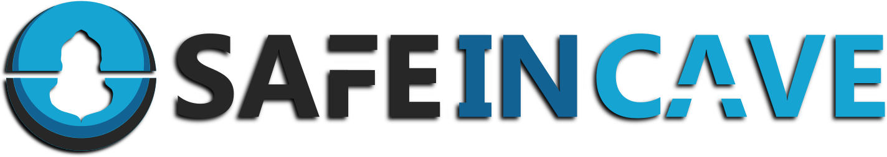

<!-- # SafeInCave Documentation -->
# 

{#fig-constitutive-model-0 width="80%"}

[](https://github.com/ADMIRE-Public/SafeInCave)
[](https://doi.org/10.5281/zenodo.17169591)
[-blue)](https://ubuntu.com/wsl)  
[](https://fenicsproject.org)
[](https://www.gnu.org/licenses/gpl-3.0.en.html)


<!-- Welcome to the SafeInCave documentation page. SafeInCave is an open-source simulator for the thermo-mechanical behavior of salt caverns.  -->

<!-- --- -->

## Overview
SafeInCave is an open-source 3D finite element simulator specifically designed for salt caverns. It combines the most relevant physical phenomena with a robust numerical scheme, making SafeInCave as a powerful tool for performance assessments of salt caverns under different operational conditions. 

{.wide-figure style="width: min(400px, 95vw);"}


## Open-source
Being **open-source** is perhaps the most important aspect of SafeInCave. This has many implications for both academic and industrial applications. Being fully transparent, auditable and reproducible is essencial to build trust in the results. Moreover, having access to the source code and being able to modify it as necessary allows for anyone to make contributions that can benefit the whole salt community!

<!-- --- -->

<!-- ???+ tip "Open by default"

    This dropdown starts expanded.

??? question "FAQ"

    This is useful for questions and answers.

??? example "Example"

    ```python
    print("Hello")
    ```

??? warning "Be careful"

    This is a warning-style dropdown.

??? note "General note"

    This is hidden by default. -->

## Key Features

<!-- - **MPI-powered parallelism**: Scale simulations efficiently with mpi4py for distributed computing -->
- **Tetrahedral meshes**: Easily discretize complex geometries without compromising numerical stability.
- **Thermodynamics**: Different fluids with different operational conditions are possible.
- **Coupled physics**: Mechanics, heat diffusion, and thermodynamic models are fully coupled.
- **Thermal effects**: Solve heat diffusion equation and include thermal strains and creep thermal responses.
- **Constitutive model**: Munson-Dawson model, two branches model, thermal strains, Cam-Clay model, etc.
- **Robust linearization**: Provides robustness and flexibility to include new constitutive models.
- **Time discretization**: Choose between Explicit, Crank-Nicolson, and Fully-Implicit schemes.
- **XDMF output**: Efficient output format in terms of size and postprocessing.

<!-- --- -->

<!-- --- -->

## Mantainers
- [Hermínio Tasinafo Honório](https://www.linkedin.com/in/herminioth/)
- [Hadi Hajibeygi](https://www.tudelft.nl/en/ceg/about-faculty/departments/geoscience-engineering/sections/reservoir-engineering/staff/academic-staff/profdr-h-hajibeygi)
- [Mathias Erdtmann](https://www.linkedin.com/in/mathias-kreutz-erdtmann/)


---

## Acknowledgements
We would like to thank:
- [Shell Global Solutions International B.V](https://www.shell.com/) for sponsoring the [project SafeInCave](https://www.tudelft.nl/en/ceg/about-faculty/departments/geoscience-engineering/research/research-themes/energy-transition/safeincave), within which this simulator was developed.
- [Energi Simulation](https://energisimulation.com/) for currently supporting this project.