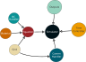

# Introduction
In SafeInCave, the user needs to combine different objects to setup a simulation, as illustrated in . There is always a *Simulator* object that receives:

- a *TimeController* object;
- a *Ouputs* object;
- a *CavernHandler* object;
- and at least one *Equation* object.

{#basic-objects width="110%"}

## *Equation* object
This is the governing equation of the problem. Currently, it can be the momentum equation, for mechanics simulations, or the heat diffusion equation, for thermal simulations. To build an *Equation* object, three other objects are necessary:

- a *BcHandler* object;
- a *Material* object;
- and a *Grid* object.

This object also has a function *solve* that solves the equation using FEniCSx. This function is properly executed by the *Simulator* object.

### *BcHandler* object
This object holds all the boundary conditions related to the *Equation* object. Each boundary condition is an object itself and they are all collected by the *BcHandler*. 

### *Material* object
The *Material* object contains all the material properties relevant to the governing equation(s) to be simulated. The only input for instantiating the object is the number of elements of the mesh. This is because properties are defined for the mesh elements, and each element can have a different property value. This is true for all material properties. 

For the mechanical model, the solid density must always be specified. Likewise, elastic properties (Young's modulus and Poisson's ratio) must also be specified by the user. Other creep parameters will depend on the specific constitutive model adopted.

### *Grid* object
The *Grid* object has all the information related to the mesh, such as number of elements/vertices, boundary elements and names, region elements and names, etc.

## *CavernHandler* object
Each cavern in the mesh can operate under different conditions. A *Cavern* object containing the operational conditions is create of each of them. These *Cavern* objects are then passed to a *CavernHandler* object that collects them all. The operational conditions contain the thermodynamic model for the cavern fluid.

The *CavernHandler* object also needs a *Grid* object as an input. This is because the mesh is used to compute cavern volumes during the simulation so that the thermodynamic model can be properly solved. 

During the simulation, the state of the caverns ($P$, $T$, $\rho$, $M$, $Q$, $V$) is also saved in a *.json* file in the results folder.

## *TimeController* object
This object orchestrates time loop within the simulator. It decides the time step size $\Delta t$ at each time $t$. If necessary, custom time controllers can be connected to the *Equation* object, so that it can decide the time step size based on resulting hardening parameter, strain rates, etc.

## *Ouputs* object
This object tells the simulator which fields to save during the simulation and where to save those fields. For the mechanical model, the user can choose to save, for example, the displacements, von Mises stresses, mean stresses, stress tensor, total strain tensor, creep strains, hardening parameter, etc. For the heat diffusion model, temperature is usually the only interest, but the heat flux vector, for example, can also be calculated in a custom function. Any property in the *Material* object can also be saved.

All the results are saved in *.xdmf* files by default. Passing `output_format="vtkhdf"` to `SaveFields` writes *.vtkhdf* files instead, the format Kitware maintains as the successor of XDMF. Both are read back by the same `safeincave.PostProcessing` readers, which pick the backend from the file extension.