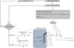

# Mechanical simulator (M)
The thermal simulator only solves the momentum balance equation, so it either receives an object of class *LinearMomentum* or *LinearMomentumMixed*, along with the usual *TimeController*, *Outputs*, and *CavernHandler* objects. 

```python
sim = Simulator_M(eq_mom, time_control, outputs, caverns)
```

The *CavernHandler* object is optional. If a *None* object is provided, then either *Neumann* or *Dirichlet*, although prescribing displacements doesn't make much sense for a cavern. 

Otherwise, if a *CavernHandler* object is provided, then the boundary condition on the cavern wall is automatically set to *Neumann* type. The cavern pressure $P_1$ is resulted from the thermodynamic model, just as the fluid's density $\rho_1$. Pressure $P_1$ refers to the mid point of the cavern in the vertical direction. Density $\rho_1$ defines the slope of the load applied on the cavern walls, as shown in [](#fig-simulator-M). If the cavern operates under prescribed mass flow rates, then both $P_1$ and $\rho_1$ are resulted from the thermodynamic model. In any case, as illustrated in [](#fig-simulator-M), as soon as the mechanical model is solved, a new cavern volume $V_1$ is calculated and the corresponding work $W$ done by the cavern walls on the fluid is also computed. With new $V_1$ and $W$, a new iterative cycle begins until convergence is reached. 

{#fig-simulator-M .wide-figure style="width: min(700px, 95vw);"}