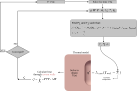

# Thermal simulator (T)
The thermal simulator only solves the heat diffusion model. Naturally, it receives an object of class *HeatDiffusion* along with the usual *TimeController*, *Outputs*, and *CavernHandler* objects. 

???+ example "Example"
    ```python
    sim = Simulator_T(eq_heat, time_control, outputs, caverns)
    ```

The *CavernHandler* object is optional. If a *None* object is provided, then either *Neumann* or *Dirichlet* boundary condition needs to be specified on the cavern walls, just as any other boundary. In this case, the problem is linear, and the heat diffusion equation is solved only once at each time step.

Otherwise, if a *CavernHandler* object is provided, then the boundary condition on the cavern wall is automatically set to *Robin* type. 

If the cavern operates under prescribed $T$, then the problem is linear. This is equivalent to prescribe *Robin* boundary condition directly to the cavern wall. 

If the cavern operates under prescribed mass flow rate, then the fluid temperature $T_1$ is calculated from the thermodynamic model, which makes the problem to be non-linear and fully coupled with the thermodynamic model. This coupling is shown in [](#fig-simulator-T).


{#fig-simulator-T .wide-figure style="width: min(700px, 95vw);"}

