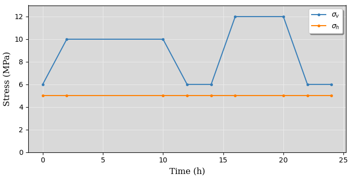
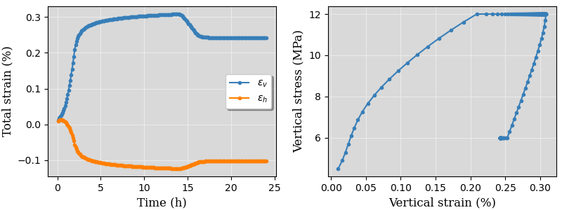

Installation
------------

.. The following dependencies are required:

.. - `PyTorch <https://pytorch.org/>`_
.. - `pandas <https://pandas.pydata.org/>`_
.. - `FEniCS 2019.1 <https://fenicsproject.org/download/archive/>`_

The SafeInCave simulator has been developed and tested only on Windows platform, but it should also work with other operational systems. In this section, only Windows installation is covered. The user can also access our `Youtube channel <https://www.youtube.com/@ADMIRE1>`_ and checkout our `video tutorial <https://www.youtube.com/watch?v=J0KQ-nBMwwU&t=0s>`_ on how to install SafeInCave simulator and its dependencies.

Windows Subsystem for Linux (WSL)
~~~~~~~~~~~~~~~~~~~~~~~~~~~~~~~~~

Because SafeInCave is based on `FEniCS 2019.1 <https://fenicsproject.org/download/archive/>`_, which can be installed on Ubuntu, the Windows installation requires the WSL. To install WSL, open the Power Shell in **administrator mode** and run the following commands:

.. code-block:: powershell

    PS C:\Users\user> Enable-WindowsOptionalFeature -Online -FeatureName Microsoft-Windows-Subsystem-Linux

Type *yes* to restart the system. After restarting, open Power Shell once more in administrator mode and run:

.. code-block:: powershell

    PS C:\Users\user> wsl --update

Ubuntu
~~~~~~

To install Ubuntu, run the following command on Power Shell:

.. code-block:: powershell

    >> wsl --install -d ubuntu

At this point, the Ubuntu terminal should be available at *Start button* -> *Ubuntu*. 

Pip3
~~~~

Most of the dependencies of the SafeInCave simulator are installed using *pip3*. To install it, run the following command on Ubuntu terminal:

.. code-block:: console
    
    user@computer:~$ sudo apt-get update
    user@computer:~$ sudo apt install python3-pip

Matplotlib
~~~~~~~~~~

Matplotlib should be installed using *pip3*. However, in order to allow for GUI interaction, it is advise to install Tkinter first:

.. code-block:: console

    user@computer:~$ sudo apt-get install python3-tk

To install Matplotlib, run the following command:

.. code-block:: console

    user@computer:~$ pip3 install matplotlib

Numpy
~~~~~~

Install numpy version 1.23.5:

.. code-block:: console

    user@computer:~$ pip3 install numpy=1.23.5

Meshio
~~~~~~

In this current version of SafeInCave, the meshio verion 3.3.1 is adopted. This version can be installed using *pip3* command, that is:

.. code-block:: console

    user@computer:~$ pip3 install meshio=3.3.1

Pytorch
~~~~~~~~

Pytorch is used in SafeInCave to perform tensor operations in a efficient way. To install PyTorch, follow these `instructions <https://pytorch.org/>`_. For example, if you want to install it on you CPU, run:

.. code-block:: console

    user@computer:~$ conda install pytorch torchvision torchaudio cpuonly -c pytorch

Otherwise, if you have GPU in your machine, run:

.. code-block:: console

    user@computer:~$ conda install pytorch torchvision torchaudio pytorch-cuda=11.8 -c pytorch -c nvidia

Pandas
~~~~~~

Pandas is another useful package for manipulating data during post-processing. To install pandas, run the following commands on Ubuntu terminal:

.. code-block:: console

    user@computer:~$ pip3 install pandas==1.4.3

Gmsh
~~~~

Gmsh is used for creating the grids in SafeInCave. First, install package *libgl1* and the install Gmsh from conda-forge, that is:

.. code-block:: console

    user@computer:~$ sudo apt install gmsh

FEniCS
~~~~~~

There are different options for installing FEniCS 2019.1, as detailed `here <https://fenicsproject.org/download/archive/>`_. To install it on Ubuntu, run the following commands:

.. code-block:: console

    user@computer:~$ sudo apt-get install software-properties-common
    user@computer:~$ sudo add-apt-repository ppa:fenics-packages/fenics
    user@computer:~$ sudo apt-get update
    user@computer:~$ sudo apt-get install fenics

SafeInCave
~~~~~~~~~~

To use SafeInCave simulator, clone the Gitlab repository to your machince:

.. code-block:: console

    user@computer:~$ git clone https://gitlab.tudelft.nl/ADMIRE_Public/safeincave.git

Running your first simulation
------------------------------

The fastest way to run a simulation is to execute the *main.py* file of one of the examples in the *examples* folder. The example in folder *safeincave/examples/triaxial* simulates a triaxial test performed on a salt rock sample of cubic shape. The salt sample is subjected to a constant confining pressure (horizontal stresses) and varying axial (vertical) load, which can be visualized by executing the *plot_bcs.py* file, that is

.. code-block:: console

    user@computer:~$ cd safeincave/examples/triaxial
    user@computer:~/safeincave/examples/triaxial$ python plot_bcs.py

which produces the image shown in :numref:`Fig. %s <triaxial-load>`. 

.. _triaxial-load:

   Loading schedule for the triaxial test example.

To run this example, simply do the following:

.. code-block:: console

    user@computer:~/safeincave/examples/triaxial$ python main.py

Once the simulation is finished, the results can be found in folder *triaxial/output/case_0*. 

The results can be visualized on `Paraview <https://www.paraview.org/>`_. Alternatively, use `matplotlib <https://matplotlib.org/stable/>`_ to visualize results by doing the following:

.. code-block:: console

    user@computer:~/safeincave/examples/triaxial$ python plot_results.py

This will generate :numref:`Fig. %s <triaxial-test>`, which shows the vertical (:math:`\varepsilon_v`) and horizontal (:math:`\varepsilon_h`) deformation over time.

.. _triaxial-test:

   Results obtained from the triaxial test simulation.

