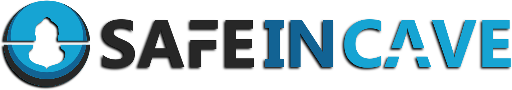

.. SafeInCave documentation master file, created by
   sphinx-quickstart on Sat Jul  6 11:37:00 2024.
   You can adapt this file completely to your liking, but it should at least
   contain the root `toctree` directive.

.

.

Salt cavern simulations made easy!
==================================

The **SafeInCave** is a 3D finite element simulator for the geomechanics of gas storage in salt caverns.
The simulator is developed in Python and it uses `FEniCS 2019.1 
<https://fenics.readthedocs.io/projects/ufl/en/2019.1.0/manual/examples.html>`_ 
for the finite element implementation.

Check out the :doc:`introduction` section for further information.

.. note::

   This project is under active development.

Getting started
---------------

.. toctree::

   getting_started

Fundamental Theory
------------------

This chapter is intended to provide the basic concepts of computational solid mechanics
necessary to understand the SafeInCave implementation.

.. toctree::

   introduction

API DOCUMENTATION
-----------------

API reference

.. toctree::
   :maxdepth: 2
   :caption: Contents:
   
   modules