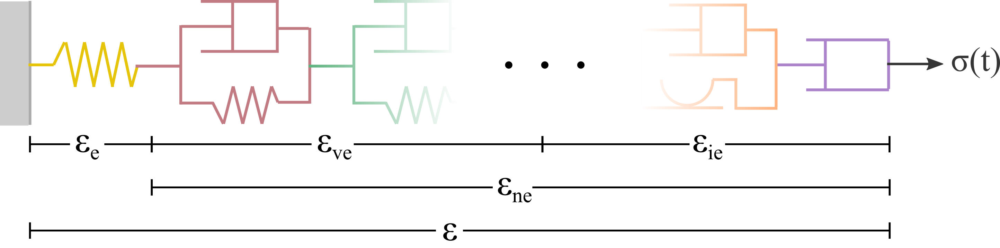

.. _initial-considerations:

Initial considerations
======================

.. admonition:: Definitions used throughout this documentation:

   - A spring describes an instantaneous (i.e. time-independent) elastic response. When a load is applied, this element instantaneously deforms to its final configuration. When the load is removed, the material instantaneously recovers to its initial configuration.

   - A Kelvin-Voigt element describes a viscoelastic (i.e. time-dependent elastic) response. When a load is applied, it takes a finite amount of time for this element to reach its final configuration (equilibrium condition). When the load is removed, the deformation is fully recovered within a finite amount of time.

   - A plastic element describes an instantaneous (i.e. time-indepentent) inelastic response. If the stresses applied exceeds a certain threshold (yield surface), this element will instantaneously deform to its final configuration. If the load is removed, the material does not recover at all. In case the applied load does not exceed the threshold, this element does not deform.

   - A viscoplastic element describes a time-dependent inelastic response. It behaves exactly as the plastic element, except that the inelastic deformations take place within a finite amount of time. For example, if the applied stresses exceed the yield surface, the material will not instantaneously reach its final configuration, but within some time.

- Stress tensor:

.. math::

   \pmb{\sigma} = 
   \begin{bmatrix}
      \sigma_{xx} & \sigma_{xy} & \sigma_{xz} \\
      \sigma_{xy} & \sigma_{yy} & \sigma_{yz} \\
      \sigma_{xz} & \sigma_{yz} & \sigma_{zz}
   \end{bmatrix}

- Identity (rank-2) tensor:

.. math::

   \mathbf{I} = 
   \begin{bmatrix}
      1 & 0 & 0 \\
      0 & 1 & 0 \\
      0 & 0 & 1
   \end{bmatrix}

- Deviatoric stress:

.. math::

   \mathbf{s} = \pmb{\sigma} - \frac{1}{3} \text{tr}(\pmb{\sigma}) \mathbf{I}

- Von Mises stress:

.. math::

   &q = \sqrt{ \frac{1}{2} \left( (s_{xx} - s_{yy})^2 + (s_{xx} - s_{zz})^2 + (s_{yy} - s_{zz})^2 + 6(s_{xy}^2 + s_{xz}^2 + s_{yz}^2) \right) }
   \\
   &\text{or}
   \\
   &q = \sqrt{\frac{3}{2} \mathbf{s} : \mathbf{s}} = \sqrt{\frac{3}{2} s_{ij} s_{ij}}
   \\
   &\text{or}
   \\
   &q = \sqrt{3J_2}

- Stress invariants of :math:`\pmb{\sigma}`:

.. math::

   &I_1 = s_{xx} + s_{yy} + s_{zz} = \text{tr} (\pmb{\sigma})
   \\
   &I_2 = s_{xx} s_{yy} + s_{yy} s_{zz} + s_{xx} s_{zz} - s_{xy}^2 - s_{yz}^2 - s_{xz}^2
   \\
   &I_3 = s_{xx} s_{yy} s_{zz} + 2 s_{xy} s_{yz} s_{xz} - s_{zz} s_{xy}^2 - s_{xx} s_{yz}^2 - s_{yy} s_{xz}^2 = \text{det}(\pmb{\sigma})

- Stress invariants of :math:`\mathbf{s}`:

.. math::
   
   &J_1 = \frac{1}{3} I_1^2 - I_2
   \\
   &J_2 = \frac{2}{27} I_1^3 - \frac{1}{3} I_1 I_2 + I_3
   \\
   &J_3 = 0

- Lode's angle, :math:`\psi`:

.. math::

   \cos(3\psi) = -\frac{\sqrt{27}}{2} \frac{J_3}{J_2^{3/2}}
   \quad
   \rightarrow
   \quad
   \psi = \frac{1}{3} \cos^{-1} \left( -\frac{\sqrt{27}}{2} \frac{J_3}{J_2^{3/2}} \right)

- Von Mises stress:

.. math::

   &q = \sqrt{ \frac{1}{2} \left( (\sigma_{xx} - \sigma_{yy})^2 + (\sigma_{xx} - \sigma_{zz})^2 + (\sigma_{yy} - \sigma_{zz})^2 + 6(\sigma_{xy}^2 + \sigma_{xz}^2 + \sigma_{yz}^2) \right) }
   \\
   &\text{or}
   \\
   &q = \sqrt{\frac{3}{2} \mathbf{s} : \mathbf{s}} = \sqrt{\frac{3}{2} s_{ij} s_{ij}}
   \\
   &\text{or}
   \\
   &q = \sqrt{3J_2}

.. _constitutive-models-section:

Constitutive models
===================

In general, a constitutive model can be represented as illustrated in :numref:`Fig. %s <introduction-constitutive-model>`, which shows a serial arrangement of different types of elements (springs, dashpots, etc). The total deformation :math:`\pmb{\varepsilon}` is given by the sum of the individual deformation of all elements composing the constitutive model. In this text, we make a distinction between **elastic** and **non-elastic** deformations. Elastic deformations :math:`\pmb{\varepsilon}_{e}` refer exclusively to time-independent (instantaneous) elastic deformations -- in other words, in only includes the deformation of the yellow spring in :numref:`Fig. %s <introduction-constitutive-model>`. The non-elastic deformations comprise the viscoelastic (:math:`\pmb{\varepsilon}_{ve}`) and inelastic (:math:`\pmb{\varepsilon}_{ie}`) deformations. In the SafeInCave simulator, the only viscoelastic element implemented is the Kelvin-Voigt element, which consists of parallel arrangement between a spring and a dashpot. More than one Kelvin-Voigt element can be arranged in series. For inelastic elements, the SafeInCave simulator provides two options: a viscoplastic element and a dislocation creep element. The viscoplastic element refers to the model proposed by Desai (1987) and used in Khaledi (2016) for salt caverns. This element can be represented by a parallel arrangement between a dashpot, which represents the time dependency, and a friction element, which indicates that the dashpot will only move if the stresses exceed a certain threshold (the yield surface). As shown below, this dashpot also includes a hardening rule that expands the yield surface. Finally, the dislocation creep element is represented by a single dashpot, that starts to deform as soon as a non-zero deviatoric stress is applied. Moreover, this element has a non-linear dependency on stress.

.. _introduction-constitutive-model:

   Constitutive model composed of elastic and non-elastic (viscoelastic and inelastic) deformations.

From the discussion above and from :numref:`Fig. %s <introduction-constitutive-model>`, it follows that total deformation can be written as

.. math::

   \pmb{\varepsilon} = \pmb{\varepsilon}_e + \underbrace{\pmb{\varepsilon}_{ve} + \pmb{\varepsilon}_{ie}}_{\pmb{\varepsilon}_{ne}}.

The mathematical formulations of these different types of elements are described in the following subsections.

.. note::

   Technically, the dislocation creep element is also a viscoplastic element, as it describes a time-dependent inelastic deformation. However, it differs from Desai's model in the sense that it does not present a yield surface. In better terms, its yield surface is a point, hence any applied deviatoric stress exceeds the yield surface.

.. note::

   In salt rocks, plastic deformations are always time-dependent, we do not address plastic deformations in this documentation. 

Kelvin-Voigt element
--------------------

The Kelvin-Voigt element consists of a parallel arrangement between a spring and a dashpot. The stress :math:`\pmb{\sigma}` applied this type of element is balanced by the stresses on the spring and dashpot. That is,

.. math::
   :label: eq:eps_ve_0

   \pmb{\sigma} = \underbrace{\mathbb{C}_1 : \pmb{\varepsilon}_{ve}}_{\text{spring}} + \underbrace{\eta_1 \dot{\pmb{\varepsilon}}_{ve}}_{\text{dashpot}}

where :math:`\pmb{\varepsilon}_{ve}` represents the deformation of both spring and dashpot. Solving Eq. :eq:`eq:eps_ve_0` for :math:`\dot{\pmb{\varepsilon}}_{ve}`,

.. math::
   :label: eq:eps_rate_ve_0

    \dot{\pmb{\varepsilon}}_{ve} = \frac{1}{\eta_1} \left( \pmb{\sigma} - \mathbb{C}_1 : \pmb{\varepsilon}_{ve} \right)

Dislocation creep element
-------------------------

The dislocation creep mechanism is commonly described by a power-law function together with Arrhenius law. The expression for the dislocation creep strain rate can be written as,

.. math::
   :label: eq:eps_rate_dc_0

   \dot{\pmb{\varepsilon}}_{cr} = A \exp \left( -\frac{Q}{RT} \right) q^{n-1} \mathbf{s}

where :math:`A` and :math:`n` are material parameters, :math:`Q` is the activation energy (in :math:`\text{J}/\text{mol}`), :math:`R` is the universal gas constant (:math:`R=8.32\text{ JK}^{-1}\text{mol}^{-1}`), and :math:`T` is the temperature in Kelvin. Additionally, :math:`q` and :math:`s` represent the Von Mises stress and the deviatoric stress, respectively.

Viscoplastic element
--------------------

The viscoplastic element follows the formulation proposed in :cite:`desai1987constitutive`, that is,

.. math::
   :label: eq:eps_rate_vp_0

   \dot{\pmb{\varepsilon}}_{vp} = \mu_1 \left\langle \dfrac{ F_{vp} }{F_0} \right\rangle^{N_1} \dfrac{\partial Q_{vp}}{\partial \pmb{\sigma}}

where :math:`\mu_1` and :math:`N_1` are material parameters, and :math:`F_0` is reference value equal to 1 MPa. The terms :math:`F_{vp}` and :math:`Q_{vp}` represent the yield and potential functions, respectively. In this work, only the associative formulation is implemented, that is, :math:`F_{vp} = Q_{vp}`. The yield function is given by 

.. math::
   :label: eq:F_vp_0

   F_{vp}(\pmb{\sigma}, \alpha) = J_2 - (-\alpha I_1^{n} + \gamma I_1^2) \left[ \exp{(\beta_1 I_1)} - \beta \cos(3\psi) \right]^m

where :math:`\gamma`, :math:`n`, :math:`\beta_1`, :math:`\beta` and :math:`m` are material parameters. The terms :math:`I_1`, :math:`J_2` and :math:`\psi` are stress invariants (see :ref:`initial-considerations`). Finally, :math:`\alpha` represents the internal hardening parameter. It's function is to enlarge the yield surface as the inelastic deformation (:math:`\xi`) accumulates in the material. The evolution equation for the hardening parameter adopted in this work has the following form,

.. math::
   :label: eq:alpha_0

   \alpha = a_1 \left[ \left( \frac{a_1}{\alpha_0} \right)^{1/\eta} + \xi \right]^{-\eta}, 

where :math:`a_1` and :math:`\eta` are material parameters, :math:`\alpha_0` is the initial hardening parameter, and the accumulated inelastic strain is given by

.. math::

   \xi = \int_{t_0}^t \sqrt{ \dot{\pmb{\varepsilon}}_{vp} : \dot{\pmb{\varepsilon}}_{vp} } \mathrm{dt}.

The initial hardening parameter can be chosen arbitrarily or based on a specific value of :math:`F_{vp}`. For a certain value :math:`F_{vp}^*`, for example, the initial hardening parameter can be computed as

.. math::

   \alpha_0 = \gamma I_1^{2-n} + \frac{F_{vp}^* - J_2}{I_1^n} \left[ \exp(\beta_1 I_1) + \beta \cos(3\psi) \right].

Evidently, placing the stress state at the onset of viscoplasticity is achieved by setting :math:`F_{vp}^* = 0`.

Mathematical Formulation
========================

Something here.

Linear momentum balance equation
--------------------------------

The linear momentum balance equation considering quasi-static loads can be written as

.. math::
   :label: eq:mom_0

   \nabla \cdot \pmb{\sigma} = \mathbf{f}

with :math:`\mathbf{f}` representing the body forces. In Eq. :eq:`eq:mom_0`, the stress is calculated as,

.. math::
   :label: eq:stress_0

   \pmb{\sigma} = \mathbb{C}_0 : \pmb{\varepsilon}_{e}

where :math:`\pmb{\varepsilon}_{e}` is the elastic strain tensor and :math:`\mathbb{C}_0` is the 4th-order tensor associated to the linear elastic response of the material (yellow spring of :numref:`Fig. %s <introduction-constitutive-model>`). However, most constitutive models for geomaterials, especially salt rocks, comprise elastic, viscoelastic (i.e. time-dependent elastic) 

.. note::
   In the present work, non-elastic deformation includes all types of deformation that are not instantaneously elastic, that is, viscoelastic (time dependent elastic) and inelastic (viscoplastic, plastic, creep, etc) deformations.

The total strain tensor can be represented as

.. math::
   :label: eq:strain_total

   \pmb{\varepsilon} = \pmb{\varepsilon}_{e} + \pmb{\varepsilon}_{ne} = \pmb{\varepsilon}_{e} + \underbrace{\pmb{\varepsilon}_{ve} + \pmb{\varepsilon}_{ie}}_{\pmb{\varepsilon}_{ne}}

where :math:`\pmb{\varepsilon}_{ve}` and :math:`\pmb{\varepsilon}_{ie}` are the viscoelastic and inelastic strains, respectively, and

.. math::
   :label: eq:eps_ne

   \pmb{\varepsilon}_{ne} = \sum_{i=1}^{N_{ne}} \pmb{\varepsilon}_{i}

with :math:`N_{ne}` denoting the number of non-elastic elements included in the constitutive model. In this manner, the stress tensor can be expressed as

.. math::
   :label: eq:stress_1

   \pmb{\sigma} = \mathbb{C}_0^{-1} : \left( \pmb{\varepsilon} - \pmb{\varepsilon}_{ne} \right)

In general, the non-elastic strain rates have a (non-)linear dependency on the stress tensor :math:`\pmb{\sigma}` and, possibly, on internal parameters :math:`\alpha_i`. For example, for a non-elastic element *i*,

.. math::
   :label: eq:eps_ne_sigma_alpha

   \dot{\pmb{\varepsilon}}_{i} = \dot{\pmb{\varepsilon}}_{i} \left( \pmb{\sigma}, \alpha_i \right)

The circular dependency of the non-elastic strains on the stress tensor :math:`\pmb{\sigma}` makes of Eq. :eq:`eq:mom_0` a non-linear equation. The numerical procedure for treating this non-linearity and solving Eq. :eq:`eq:mom_0` is described below.

Numerical formulation
=====================

Time integration
----------------

The strain tensor at time :math:`t + \Delta t` of a given non-elastic element :math:`i` can be approximated by

.. math::
   
   \pmb{\varepsilon}_{i}^{t+\Delta t} = \pmb{\varepsilon}^t_{i} + \Delta t \dot{\pmb{\varepsilon}}_{i}^\theta

where :math:`\dot{\pmb{\varepsilon}}_{i}^\theta = \theta \dot{\pmb{\varepsilon}}_{i}^t + (1 - \theta) \dot{\pmb{\varepsilon}}_{i}^{t+\Delta t}`, and :math:`\theta` can be chosen among 0.0, 0.5 and 1.0 for fully implicit, Crank-Nicolson and explicit time integration, respectively. However, the strain rate :math:`\dot{\pmb{\varepsilon}}_{i}^{t+\Delta t}` is unknown and it will be determined in a iterative process, so we drop the superscript :math:`t+\Delta t` and replace it by :math:`k+1`, where :math:`k` denotes the iterative level. In this manner, the strain of element :math:`i` at iteration :math:`k+1` is

.. math::
   :label: eq:eps_time_integration

   \pmb{\varepsilon}^{k+1}_{i} = \pmb{\varepsilon}^t_{i} + \Delta t \theta \dot{\pmb{\varepsilon}}^t_{i} + \Delta t (1 - \theta) \dot{\pmb{\varepsilon}}^{k+1}_{i}.

For conciseness, let us consider :math:`\phi_1 = \Delta t \theta` and :math:`\phi_2 = \Delta t (1 - \theta)`. Recalling Eq. :eq:`eq:eps_ne` and substituting Eq. :eq:`eq:eps_time_integration` into Eq. :eq:`eq:stress_1`, the stress tensor at iteration :math:`k+1` is expressed as

.. math::
   :label: eq:stress_2
   
   \pmb{\sigma}^{k+1} = \mathbb{C}_0 : \left( \pmb{\varepsilon}^{k+1} - \pmb{\varepsilon}^t_{ne} - \phi_1 \dot{\pmb{\varepsilon}}^t_{ne} - \phi_2 \dot{\pmb{\varepsilon}}^{k+1}_{ne} \right)

where :math:`\dot{\pmb{\varepsilon}}^{k+1}_{ne}` is obviously unknown, which requires a linearization method for its evaluation.

.. note::

   Keep in mind that both :math:`\pmb{\varepsilon}^t_{i}` and :math:`\dot{\pmb{\varepsilon}}^t_{i}` are known quantities.

Picard's method
---------------

One alternative to linearize Eq. :eq:`eq:stress_2` is to simply consider

.. math::
   
   \dot{\pmb{\varepsilon}}^{k+1}_{i} = \dot{\pmb{\varepsilon}}^{k}_{i}

in which :math:`\dot{\pmb{\varepsilon}}^{k}_{i} = \dot{\pmb{\varepsilon}}_{i} \left( \pmb{\sigma}^k, \alpha^k_i \right)`. As a consequence, the stress tensor is linearized as

.. math::
   
   \pmb{\sigma}^{k+1} = \mathbb{C}_0 : \left( \pmb{\varepsilon}^{k+1} - \pmb{\varepsilon}^t_{ne} - \phi_1 \dot{\pmb{\varepsilon}}^t_{ne} - \phi_2 \dot{\pmb{\varepsilon}}^{k}_{ne} \right)

and the momentum balance equation becomes

.. math::
   :label: eq:mom_picard

   \nabla \cdot \mathbb{C}_0 : \pmb{\varepsilon}^{k+1} = \mathbf{f} + \nabla \cdot \mathbb{C}_0 : \left( \pmb{\varepsilon}^t_{ne} + \phi_1 \dot{\pmb{\varepsilon}}^t_{ne} + \phi_2 \dot{\pmb{\varepsilon}}^{k}_{ne} \right).

Although very simple, Eq. :eq:`eq:mom_picard` requires many iterations to converge and it is often unstable, especially when highly non-linear deformations are present.

Newton's method
---------------

Alternatively, the strain rate can be expanded from iteration :math:`k` to iteration :math:`k+1` by using Taylor series, that is,

.. math::
   :label: eq:eps_newton_0

   \dot{\pmb{\varepsilon}}^{k+1}_{i} = \dot{\pmb{\varepsilon}}^{k}_{i} + \frac{\partial \dot{\pmb{\varepsilon}}_{i}}{\partial \pmb{\sigma}} : \delta \pmb{\sigma} + \frac{\partial \dot{\pmb{\varepsilon}}_{i}}{\partial \alpha_i} \delta \alpha_i

where :math:`\delta \pmb{\sigma} = \pmb{\sigma}^{k+1} - \pmb{\sigma}^k` and :math:`\delta \alpha_i = \alpha_i^{k+1} - \alpha_i^k`.

.. note::

   The term :math:`\frac{\partial \dot{\pmb{\varepsilon}}_{i}}{\partial \pmb{\sigma}}` is a rank-4 tensor, whereas :math:`\delta \pmb{\sigma}` is a rank-2 tensor, hence the double dot product between them, which results a rank-2 tensor.

The increment of internal variable :math:`\delta \alpha_i` can be obtained by defining a residual equation of the evolution equation of :math:`\alpha_i` and using Newton-Raphson to drive the residue to zero. Considering the residual equation is of the form :math:`r_i = r_i(\pmb{\sigma}, \alpha_i)`, it follows that

.. math::
   :label: eq:delta_alpha

   r_i^{k+1} = r^k + \frac{\partial r_i}{\partial \pmb{\sigma}} : \delta \pmb{\sigma} + \underbrace{\frac{\partial r_i}{\partial \alpha_i}}_{h_i} \delta \alpha_i = 0
   \quad \rightarrow \quad
   \delta \alpha_i = - \frac{1}{h_i} \left( r_i^k + \frac{\partial r_i}{\partial \pmb{\sigma}} : \delta \pmb{\sigma} \right).

Substituting Eq. :eq:`eq:delta_alpha` into Eq. :eq:`eq:eps_newton_0` yields

.. math::

   \dot{\pmb{\varepsilon}}^{k+1}_{i} 
   = \dot{\pmb{\varepsilon}}^{k}_{i} 
   + \underbrace{
      \left( \frac{\partial \dot{\pmb{\varepsilon}}_{i}}{\partial \pmb{\sigma}} - \frac{1}{h_i} \frac{\partial \dot{\pmb{\varepsilon}}_{i}}{\partial \alpha_i} \frac{\partial r_i}{\partial \pmb{\sigma}} \right)
      }_{\mathbb{G}_i} : \delta \pmb{\sigma} 
   - \underbrace{ \frac{r_i^k}{h_i} \frac{\partial \dot{\pmb{\varepsilon}}_{i}}{\partial \alpha_i} }_{\mathbf{B}_i}

Considering all non-elastic elements,   

.. math::
   :label: eq:eps_newton_1

   \dot{\pmb{\varepsilon}}^{k+1}_{ne} 
   = \dot{\pmb{\varepsilon}}^{k}_{ne}
   + \mathbb{G}_{ne} : \delta \pmb{\sigma} 
   - \mathbf{B}_{ne}

where :math:`\mathbb{G}_{ne} = \sum_{i=1}^{N_{ne}} \mathbb{G}_i` and :math:`\mathbf{B}_{ne} = \sum_{i=1}^{N_{ne}} \mathbf{B}_i`.

Finally, substituting Eq. :eq:`eq:eps_newton_1` into Eq. :eq:`eq:stress_2` leads to

.. math::
   :label: eq:stress_3

   \pmb{\sigma}^{k+1} = \mathbb{C}_T : \left[
      \pmb{\varepsilon}^{k+1}
      - \bar{\pmb{\varepsilon}}^k_{ne}
      + \phi_2 \left(
         \mathbb{G}_{ne} : \pmb{\sigma}^k
         + \mathbf{B}_{ne}
      \right)
   \right]

where :math:`\bar{\pmb{\varepsilon}}^k_{ne} = \pmb{\varepsilon}^t_{ne} + \phi_1 \dot{\pmb{\varepsilon}}^t_{ne} + \phi_2 \dot{\pmb{\varepsilon}}^{k}_{ne}` and the consistent tangent matrix :math:`\mathbb{C}_T` is given by

.. math::

   \mathbb{C}_T = \left( \mathbb{C}_0^{-1} + \phi_1 \mathbb{G}_{ne} \right)^{-1}.

We can further simplify Eq. :eq:`eq:stress_3` by defining

.. math::

   \pmb{\varepsilon}_{\text{rhs}}^k = \bar{\pmb{\varepsilon}}^k_{ne} - \phi_2 \left(
         \mathbb{G}_{ne} : \pmb{\sigma}^k
         + \mathbf{B}_{ne} \right)

In this manner, the stress tensor can be expressed as

.. math::
   :label: eq:stress_4

   \pmb{\sigma}^{k+1} = \mathbb{C}_T : \left(
      \pmb{\varepsilon}^{k+1}
      - \pmb{\varepsilon}^k_{\text{rhs}}
   \right)

and the linearized momentum balance equation becomes

.. math::
   :label: eq:mom_2

   \nabla \cdot \mathbb{C}_T : \pmb{\varepsilon}^{k+1}
    =
    \mathbf{f}
    + \nabla \cdot \mathbb{C}_T : \pmb{\varepsilon}_\text{rhs}^k

   

.. note::

   It is important to note that :math:`\mathbb{G}_{ne}` is a rank-4 tensor, hence the double dot product :math:`:` between :math:`\mathbb{G}_{ne}` and :math:`\pmb{\sigma}^k`. On the other hand, :math:`\mathbf{B}_{ne}` is a rank-2 tensor.

Weak formulation
----------------

Consider a domain :math:`\Omega` bounded by a surface :math:`\Gamma` outward oriented by a normal vector :math:`\mathbf{n}`. Additionally, consider a vector **test** function :math:`\mathbf{v} \in \mathcal{V}` and a vector **trial** function :math:`\mathbf{u} \in \mathcal{V}`, where :math:`\mathcal{V}` is the test function space generated by continuous piecewise linear polynomials. In this manner, the weak formulation of the linearized momentum balance equation can be expressed as, 

.. math::

   \underbrace{
        \int_\Omega \mathbb{C}_T : \pmb{\varepsilon} \left( \mathbf{u}^{k+1} \right) : \pmb{\varepsilon} \left( \mathbf{v} \right) \text{d} \Omega
    }_{
        a\left( \mathbf{u}, \mathbf{v} \right)
    }
    =
    \underbrace{
        \int_\Omega \mathbf{f} \cdot \mathbf{v} \text{d} \Omega
        +
        \int_\Gamma \mathbf{t} \cdot \mathbf{v} \text{d} \Gamma
        +
        \int_\Omega \mathbb{C}_T : \pmb{\varepsilon}_\text{rhs}^k : \pmb{\varepsilon} \left( \mathbf{v} \right) \text{d} \Omega
    }_{
        L\left( \mathbf{v} \right)
    }

where :math:`a\left( \mathbf{u}, \mathbf{v} \right)` and :math:`L\left( \mathbf{v} \right)` represent the well-known bilinear a linear operators, respectively. The term :math:`\mathbf{t}` is the traction vector applied at the portion of :math:`\Gamma` where Neumann boundary conditions are imposed. Additionally, due to small strain assumption,

.. math::

   \pmb{\varepsilon}(\mathbf{w}) = \frac{1}{2} \left( \nabla \mathbf{w} + \nabla \mathbf{w}^T \right),

in which :math:`\mathbf{w} \in \mathcal{V}`.

Algorithms
~~~~~~~~~~

.. code-block:: latex

   BEGIN
      INPUTS param1, param2
      IF param1 > param2 THEN
         :math:`\sqrt{param1^2 + param2^2}`
         RETURN param1 - param2
      ELSE
         RETURN param2 - param1
      ENDIF
   END

.. bibliography:: references.bib
   :style: plain