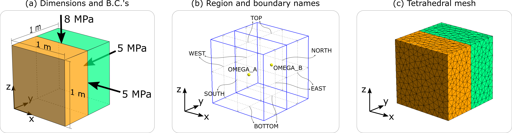
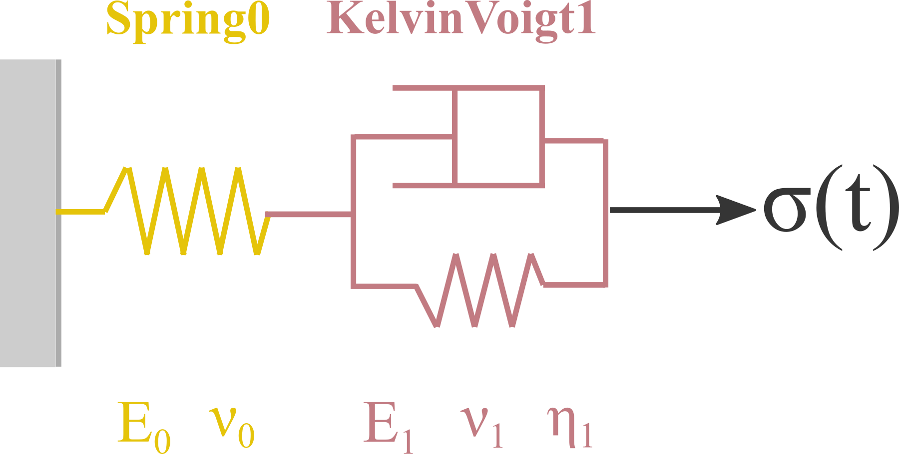
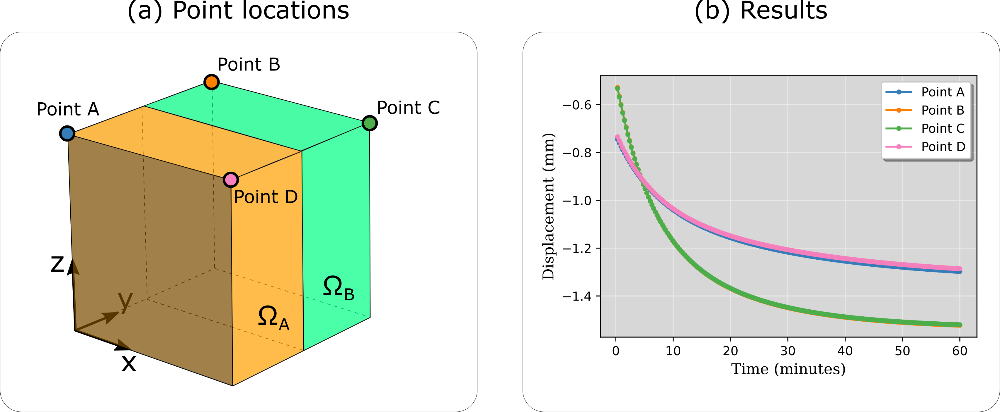
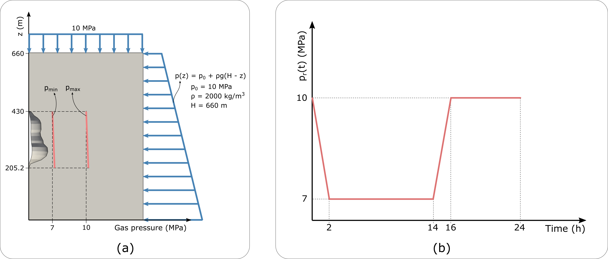
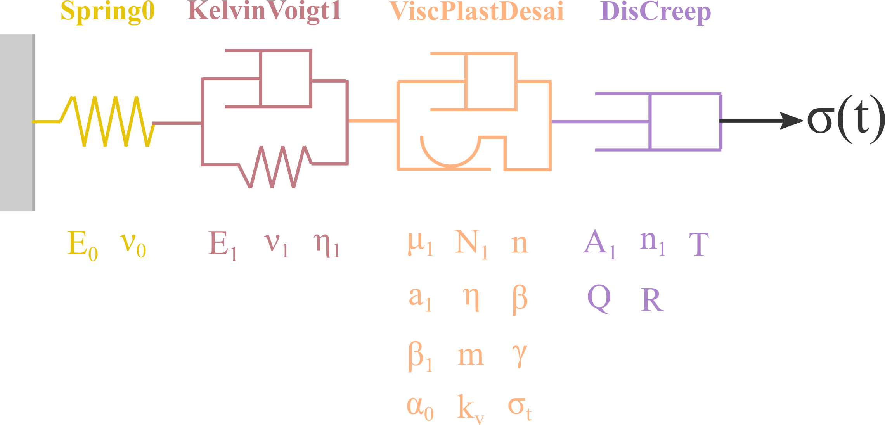
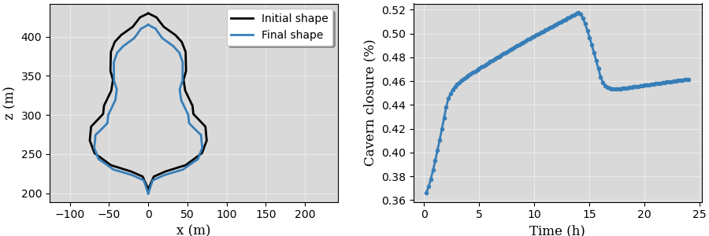

Tutorial 1
----------

In this example, we simulate a cubic material subjected to a triaxial stress condition. The domain :math:`\Omega`, its dimensions and boundary conditions are shown in :numref:`Fig. %s-a <tutorial-1-geom>`. :numref:`Fig. %s-b <tutorial-1-geom>` presents the corresponding names of the geometry boundaries and regions. Finally, :numref:`Fig. %s-c <tutorial-1-geom>` shows the tetrahedral mesh used for this problem.

.. _tutorial-1-geom:

   Boundary names, region (subdomain) names and computational mesh.

The domain :math:`\Omega` is bounded by a closed surface :math:`\Gamma`. For mathematical convenience, let us split :math:`\Gamma` into non-overlapping subsets comprising each boundary shown in :numref:`Figure %s-b <tutorial-1-geom>`, such that 

.. math::

    \Gamma_\text{west} &= \{ \mathbf{r} \in \Omega | x = 0 \} \\
    \Gamma_\text{east} &= \{ \mathbf{r} \in \Omega | x = 1\text{ m} \} \\
    \Gamma_\text{south} &= \{ \mathbf{r} \in \Omega | y = 0 \} \\
    \Gamma_\text{north} &= \{ \mathbf{r} \in \Omega | y = 1\text{ m} \} \\
    \Gamma_\text{bottom} &= \{ \mathbf{r} \in \Omega | z = 0 \} \\
    \Gamma_\text{top} &= \{ \mathbf{r} \in \Omega | z = 1\text{ m} \},

and :math:`\Gamma = \Gamma_\text{west} \cup \Gamma_\text{east} \cup \Gamma_\text{south} \cup \Gamma_\text{north} \cup \Gamma_\text{bottom} \cup \Gamma_\text{top}`. Finally, the boundary conditions applied for this problem can be written as,

.. math::

    u(\mathbf{r},t) = 0, \quad \quad &\forall \quad \mathbf{r} \in \Gamma_\text{west}, \\
    v(\mathbf{r},t) = 0, \quad \quad &\forall \quad \mathbf{r} \in \Gamma_\text{south}, \\
    w(\mathbf{r},t) = 0, \quad \quad &\forall \quad \mathbf{r} \in \Gamma_\text{bottom}, \\
    \pmb{\sigma}(\mathbf{r},t) \cdot \mathbf{n} = 5 \text{ MPa}, \quad &\forall \quad \mathbf{r} \in \Gamma_\text{east}, \\
    \pmb{\sigma}(\mathbf{r},t) \cdot \mathbf{n} = 5 \text{ MPa}, \quad &\forall \quad \mathbf{r} \in \Gamma_\text{north}, \\
    \pmb{\sigma}(\mathbf{r},t) \cdot \mathbf{n} = 8 \text{ MPa}, \quad &\forall \quad \mathbf{r} \in \Gamma_\text{top}.

The material behavior represented by a constitutive model composed of a linear spring and a Kelvin-Voigt element (i.e. viscoelastic model), as shown in :numref:`Fig. %s <tutorial-1-model>`.

.. _tutorial-1-model:

   Viscoelastic constitutive model considered for Tutorial 1.

:numref:`Figure %s-b <tutorial-1-geom>` also shows that the cubic sample is divided in two regions (subdomains), called :math:`\Omega_A` and :math:`\Omega_B`. Different material properties are assigned to these two regions, and they are summarized in :numref:`Table %s <table-tutorial-1>`.

.. _table-tutorial-1:

.. list-table:: Material properties for domains :math:`\Omega_A` and :math:`\Omega_B`.
   :widths: 25 25 25
   :header-rows: 1

   * - Property name
     - Domain :math:`\Omega_A`
     - Domain :math:`\Omega_B`
   * - :math:`E_0` (GPa)
     - :math:`8`
     - :math:`10`
   * - :math:`\nu_0` (-)
     - :math:`0.2`
     - :math:`0.3`
   * - :math:`E_1` (GPa)
     - :math:`8`
     - :math:`5`
   * - :math:`\nu_1` (-)
     - :math:`0.35`
     - :math:`0.28`
   * - :math:`\eta_1` (Pa.s)
     - :math:`105\times 10^{11}`
     - :math:`38\times 10^{11}`

The next subsection describes the creation of the input file for this particular problem.

Build input file
~~~~~~~~~~~~~~~~

:numref:`Listing %s <tutorial-1-codeblock-1>` imports the necessary modules and defines some useful units to be used throughout this example. Notice the *dolfin* package is imported in line 6. The reason for this is because we want to loop over the mesh elements to identify to which region (:math:`\Omega_A` or :math:`\Omega_B`) each element belongs to. For this, we some tools from *dolfin* package.

.. _tutorial-1-codeblock-1:

.. code-block:: python
    :linenos:
    :emphasize-lines: 6
    :caption: Import modules.

    import os
    import sys
    import numpy as np
    sys.path.append(os.path.join("..", "..", "safeincave"))
    from InputFileAssistant import BuildInputFile
    import dolfin as do

    # Useful units
    hour = 60*60
    day = 24*hour
    MPa = 1e6
    GPa = 1e9

Initialize input file object.

.. code-block:: python
    :linenos:

    ifa = BuildInputFile()

Create *input_grid* section.

.. code-block:: python
    :linenos:

    path_to_grid = os.path.join("..", "..", "grids", "cube")
    ifa.section_input_grid(path_to_grid, "geom")

Create *output* section.

.. code-block:: python
    :linenos:

    ifa.section_output(os.path.join("output", "case_0"))

Create *solver_settings* section and choose conjugate gradient method with algebraic multi-grid for solving the linear system.

.. code-block:: python
    :linenos:

    solver_settings = {
        "type": "KrylovSolver",
        "method": "cg",
        "preconditioner": "petsc_amg",
        "relative_tolerance": 1e-12,
    }
    ifa.section_solver(solver_settings)

Create *simulation_settings* section. Note in line 3 that we set the *equilibrium* stage to **False**. Since the external loads applied to the cubic sample are constant in time and the constitutive model is viscoelastic, running only the *equilibrium* stage or only the *operational* stage will produce the same result (provided that the time step sizes are the same in these two stages). Setting both stages to **True**, however, would produce zero results for the *operational* stage. 

.. tip::

    The user is encouraged to play with the *equilibrium* and *operational* stages and checking the results in */output/case_0/equilibrium* and */output/case_0/operational*.

.. code-block:: python
    :linenos:
    :emphasize-lines: 3

    ifa.section_simulation(simulation_settings = {
                                "equilibrium": {
                                    "active": False,
                                    "dt_max": 0.5*hour,
                                    "time_tol": 1e-4
                                },
                                "operation": {
                                    "active": True,
                                    "dt_max": 0.005*hour,
                                    "n_skip": 1
                                }
                           })

Create *body_forces* section.

.. code-block:: python
    :linenos:

    salt_density = 2000
    ifa.section_body_forces(value=salt_density, direction=2)

Create *time_settings* section. The transient simulation is set to run from :math:`t=0` to :math:`t=1.0` hour, and the fully-implicit method is chosen for time integration.

.. code-block:: python
    :linenos:

    time_list = [0*hour,  1*hour]
    ifa.section_time(time_list, theta=0.0)

Create *boundary_conditions* section. Boundaries *WEST*, *SOUTH* and *BOTTOM* are prevented from normal displacement (Dirichlet boundary condition). A normal compressive load is applied to boundaries *EAST*, *NORTH* and *TOP*, and the corresponding loading values are respectively shown in lines 37, 47 and 57.

.. code-block:: python
    :linenos:
    :emphasize-lines: 37, 47, 57

    ifa.section_boundary_conditions()

    # Add Dirichlet boundary conditions
    ifa.add_boundary_condition(
        boundary_name = "WEST",
        bc_data = {
            "type": "dirichlet",
            "component": 0,
            "values": list(np.zeros(len(time_list)))
        }
    )
    ifa.add_boundary_condition(
        boundary_name = "SOUTH",
        bc_data = {
            "type": "dirichlet",
            "component": 1,
            "values": list(np.zeros(len(time_list)))
        }
    )
    ifa.add_boundary_condition(
        boundary_name = "BOTTOM",
        bc_data = {
            "type": "dirichlet",
            "component": 2,
            "values": list(np.zeros(len(time_list)))
        }
    )

    # Add Neumann boundary condition
    ifa.add_boundary_condition(
        boundary_name = "EAST",
        bc_data = {
            "type": "neumann",
            "direction": 2,
            "density": 0,
            "reference_position": 1.0,
            "values": [5*MPa, 5*MPa]
        }
    )
    ifa.add_boundary_condition(
        boundary_name = "NORTH",
        bc_data = {
            "type": "neumann",
            "direction": 2,
            "density": 0,
            "reference_position": 1.0,
            "values": [5*MPa, 5*MPa]
        }
    )
    ifa.add_boundary_condition(
        boundary_name = "TOP",
        bc_data = {
            "type": "neumann",
            "direction": 2,
            "density": 0.0,
            "reference_position": 1.0,
            "values": [8*MPa, 8*MPa]
        }
    )

Before creating the *constitutive_model* section, we first mark the element of the grid that belong to regions :math:`\Omega_A` and :math:`\Omega_B`. The first step is to check the tags (integers) used by FEniCS to identify these two subdomains. This can be achieved the *get_subdomain_tag* function of the *grid* object belonging to object *ifa*. That is,

.. _tutorial-1-tags:

.. code-block:: pycon
    :caption: Subdomain tags.
    
    >>> region_marker_A = ifa.grid.get_subdomain_tags("OMEGA_A")
    >>> print(region_marker_A)
    1
    >>> region_marker_B = ifa.grid.get_subdomain_tags("OMEGA_B")
    >>> print(region_marker_B)
    2

As shown in :numref:`Listing %s <tutorial-1-tags>`, the tags corresponding to subdomains :math:`\Omega_A` and :math:`\Omega_B` are 1 and 2, respectively. This information is used in :numref:`Listing %s <tutorial-1-regions>` to store the element indices belonging to regions :math:`\Omega_A` and :math:`\Omega_B` in lists *index_A* and *index_B*, respectively. In line 6, the attribute *subdomains* is a dolfin *MeshFunction* object that retrieves the subdomain tag associated to element *cell*. This can be compared to the corresponding tags of each region to decide whether the element index is stored in *index_A* or *index_B*.

.. _tutorial-1-regions:

.. code-block:: python
    :linenos:
    :caption: Identifying element regions.

    index_A = []
    index_B = []

    # Sweep over the grid regions and elements
    for cell in do.cells(ifa.grid.mesh):
        region_marker = ifa.grid.subdomains[cell]
        if region_marker == ifa.grid.get_subdomain_tags("OMEGA_A"):
            index_A.append(cell.index())
        elif region_marker == ifa.grid.get_subdomain_tags("OMEGA_B"):
            index_B.append(cell.index())
        else:
            raise Exception("Subdomain tag not valid. Check your mesh file.")

Now that we have identified to which region each element belongs to, we can create the *constitutive_model* section with appropriate lists of material properties. 

.. code-block:: python
    :linenos:

    ifa.section_constitutive_model()

As summarized in :numref:`Table %s <table-tutorial-1>`, the Young's modulus of the linear spring for regions :math:`\Omega_A` and :math:`\Omega_B` are 8 GPa and 10 GPa, respectively. These two properties are assigned in lines 3 and 4 of :numref:`Listing %s <tutorial-1-model-spring>`. Notice how *index_A* and *index_B* are used as indices of numpy array *E*, created in line 2. A similar procedure is done for assigning the Poisson's ratios in lines 6, 7 and 8.

.. _tutorial-1-model-spring:

.. code-block:: python
    :linenos:
    :caption: Assign linear spring to constitutive model.

    # Add elastic properties
    E = np.zeros(ifa.n_elems)
    E[index_A] = 8*GPa
    E[index_B] = 10*GPa

    nu = np.zeros(ifa.n_elems)
    nu[index_A] = 0.2
    nu[index_B] = 0.3

    ifa.add_elastic_element(
        element_name = "Spring0", 
        element_parameters = {
            "type": "Spring",
            "active": True,
            "parameters": {
                "E": list(E),
                "nu": list(nu)
            }
        }
    )

The viscoelastic properties (:math:`E_1`, :math:`\nu_1` and :math:`\eta_1`) are assigned in the same manner in lines 2, 3, 5, 6, 9 and 10 of :numref:`Listing %s <tutorial-1-model-viscoelastic>`.

.. _tutorial-1-model-viscoelastic:

.. code-block:: python
    :linenos:
    :caption: Assign viscoelastic properties.
    
    # Add viscoelastic properties
    E[index_A] = 8*GPa
    E[index_B] = 5*GPa

    nu[index_A] = 0.35
    nu[index_B] = 0.28

    eta = np.zeros(ifa.n_elems)
    eta[index_A] = 105e11
    eta[index_B] = 38e11

    # Add viscoelastic properties
    ifa.add_viscoelastic_element(
        element_name = "KelvinVoigt1", 
        element_parameters = {
            "type": "KelvinVoigt",
            "active": True,
            "parameters": {
                "E":    list(E),
                "nu":   list(nu),
                "eta":  list(eta)
            }
        }
    )

Finally, the input_file.json is saved in the current directory.

.. code-block:: python
    :linenos:

    ifa.save_input_file("input_file.json")

To run this example, execute the *main.py* file in *examples/tutorial_1* folder. That is,

.. code-block:: console

    (myenv) user@institution:~/safeincave$ cd examples/tutorial_1
    (myenv) user@institution:~/safeincave/examples/tutorial_1$ python main.py

Visualize results
~~~~~~~~~~~~~~~~~

The results for equilibrium and operational stages are respectively stored in *output/case_0/equilibrium* and *output/case_0/operational* folders. Although these results can be readily visualized in Paraview, the code below shows how to plot the vertical displacements on boundary *TOP* over time using Python. 

:numref:`Listing %s <tutorial-1-results-1>` imports the necessary modules. Notice the function *read_vector_from_points* is imported from *ResultsHandler*, which is responsible for reading the vtk files, extracting the vector field defined on all nodes for all time steps, and saving them in pandas datasets. This facilitates the manipulation of results.

.. _tutorial-1-results-1:

.. code-block:: python
    :linenos:
    :caption: Results visualization for Tutorial 1.

    import os
    import sys
    sys.path.append(os.path.join("..", "..", "safeincave"))
    import numpy as np
    import pandas as pd
    import matplotlib.pyplot as plt
    from ResultsHandler import read_vector_from_points

The next code-block reads the displacement results from folder *operation*. Variable *df_coord* stores the coordinates of all grid nodes, whereas *u*, *v* and *w* stores the displacement components for all time steps of the simulation.

.. code-block:: python
    :linenos:

    pvd_path = os.path.join("output", "case_0", "operation", "vtk", "displacement")
    pvd_file = "displacement.pvd"
    df_coord, u, v, w = read_vector_from_points(pvd_path, pvd_file)

Points A, B, C and D are shown in :numref:`Fig. %s-a <tutorial-1-results-0>`. To access the displacement at these points, it is necessary to identify their corresponding indexes. This is performed in the code-block below.

.. code-block:: python
    :linenos:

    point_A = df_coord[(df_coord["z"]==1) & (df_coord["x"]==0) & (df_coord["y"]==0)].index[0]
    point_B = df_coord[(df_coord["z"]==1) & (df_coord["x"]==0) & (df_coord["y"]==1)].index[0]
    point_C = df_coord[(df_coord["z"]==1) & (df_coord["x"]==1) & (df_coord["y"]==1)].index[0]
    point_D = df_coord[(df_coord["z"]==1) & (df_coord["x"]==1) & (df_coord["y"]==0)].index[0]
    print(point_A, point_B, point_C, point_D)

Once the indices of the points of interest are identified, they can be used to access the vertical displacement *w* at these points. The list of time steps can also be retrieved from dataset *w*, as performed in line 5 of the code-block below.

.. code-block:: python
    :linenos:
    :emphasize-lines: 5

    w_A = w.iloc[point_A].values[1:]
    w_B = w.iloc[point_B].values[1:]
    w_C = w.iloc[point_C].values[1:]
    w_D = w.iloc[point_D].values[1:]
    t = w.iloc[point_A].index.values[1:]

Finally, plot the results using Matplotlib.

.. code-block:: python
    :linenos:

    # Plot pressure schedule
    fig, ax = plt.subplots(1, 1, figsize=(5, 3.5))
    fig.subplots_adjust(
        top=0.970, bottom=0.135, left=0.140, right=0.980, hspace=0.35, wspace=0.225
    )

    ax.plot(t/60, w_A*1000, ".-", color="#377eb8", label="Point A")
    ax.plot(t/60, w_B*1000, ".-", color="#ff7f00", label="Point B")
    ax.plot(t/60, w_C*1000, ".-", color="#4daf4a", label="Point C")
    ax.plot(t/60, w_D*1000, ".-", color="#f781bf", label="Point D")
    ax.set_xlabel("Time (minutes)", size=12, fontname="serif")
    ax.set_ylabel("Displacement (mm)", size=12, fontname="serif")
    ax.grid(True)
    ax.legend(loc=0, shadow=True, fancybox=True)

    plt.show()

.. _tutorial-1-results-0:

   Position of points of interest (a) and the corresponding vertical displacements over time (b).

The results presented in :numref:`Fig. %s-b <tutorial-1-results-0>` reveal an interesting behavior. As shown in :numref:`Table %s <table-tutorial-1>`, the Young's modulus of the linear spring (:math:`E_0`) for :math:`\Omega_A` is smaller than for :math:`\Omega_B`. In other words, :math:`\Omega_B` is instantaneously stiffer than :math:`\Omega_A`. For this reason, immediately after the load is applied, points A and D, which belong to :math:`\Omega_A`, present larger displacements than the other two points on :math:`\Omega_B`. However, the Kelvin-Voigt spring is stiffer for :math:`\Omega_A` than for :math:`\Omega_B`. Therefore, as time passes by, the Kelvin-Voigt element slowly starts to the deform and the displacements at points B and C (:math:`\Omega_B`) take over the other two points on :math:`\Omega_A`.

Tutorial 2
----------

This tutorial intends to setup a simulation for hydrogen storage in a salt cavern. The domain :math:`\Omega` and its dimensions are depicted in :numref:`Fig. %s-a <tutorial-2-geom-mesh>`. This figure also shows the tetrahedral mesh employed, with mesh refinement close to the cavern walls. The names of each boundary for correctly applying the boundary conditions are shown in :numref:`Figure %s-b <tutorial-2-geom-mesh>`.

.. _tutorial-2-geom-mesh:

.. figure:: _static/tutorial_2_geom_mesh_1.png
   :alt: block
   :align: center
   :width: 80%

   Geometry dimensions and mesh (a); boundary and region names (b).

As illustrated in :numref:`Fig. %s-a <tutorial-2-loading-schedule>`, a constant overburden of 10 MPa is applied to the geometry, whereas the a sideburden increases with depth according to salt density. This figure also presents a schematic representation of the gas pressure imposed on the cavern walls, showing the minimum (7 MPa) and maximum (10 MPa) gas pressure at the cavern roof.

.. _tutorial-2-loading-schedule:

   Planar view of overburden and sideburden (a); time history of gas pressure at cavern roof (b).

The domain :math:`\Omega` is bounded by a closed surface :math:`\Gamma`. For mathematical convenience, let us split :math:`\Gamma` into non-overlapping subsets comprising each boundary shown in :numref:`Figure %s-b <tutorial-2-geom-mesh>`, such that 

.. math::

    \Gamma = \Gamma_\text{bottom} \cup \Gamma_\text{top} \cup \Gamma_\text{south} \cup \Gamma_\text{north} \cup \Gamma_\text{west} \cup \Gamma_\text{east} \cup \Gamma_\text{cavern}.

In this manner, the boundary conditions applied to this problem can be written as,

.. math::

    u(\mathbf{r},t) = 0, \quad \quad &\forall \quad \mathbf{r} \in \Gamma_\text{west}, \\
    v(\mathbf{r},t) = 0, \quad \quad &\forall \quad \mathbf{r} \in \Gamma_\text{south}, \\
    w(\mathbf{r},t) = 0, \quad \quad &\forall \quad \mathbf{r} \in \Gamma_\text{bottom}, \\
    \pmb{\sigma}(\mathbf{r},t) \cdot \mathbf{n} = p_1(z), \quad &\forall \quad \mathbf{r} \in \Gamma_\text{east}, \\
    \pmb{\sigma}(\mathbf{r},t) \cdot \mathbf{n} = p_1(z), \quad &\forall \quad \mathbf{r} \in \Gamma_\text{north}, \\
    \pmb{\sigma}(\mathbf{r},t) \cdot \mathbf{n} = p_1(z), \quad &\forall \quad \mathbf{r} \in \Gamma_\text{top}, \\
    \pmb{\sigma}(\mathbf{r},t) \cdot \mathbf{n} = p_2(z,t), \quad &\forall \quad \mathbf{r} \in \Gamma_\text{cavern},

in which

.. math::
    
    p_1(z) &= p_h + \rho_\text{salt} g (H - z), \\
    p_2(z,t) &= p_r(t) + \rho_{\text{H}_2} g (H_r - z),

with :math:`\rho_\text{salt} = 2000` :math:`\text{kg}/\text{m}^3`, :math:`\rho_{\text{H}_2} = 10` :math:`\text{kg}/\text{m}^3`, :math:`H_r = 430` :math:`\text{m}`, :math:`p_h = 10` :math:`\text{MPa}` and :math:`p_r(t)` is shown in :numref:`Fig. %s-b <tutorial-2-loading-schedule>`.

The constitutive model employed in this example is shown in :numref:`Fig. %s <tutorial-2-model>`. It comprises a linear spring for instantaneous elastic response, a Kelvin-Voigt element for time dependent elasticity (i.e. viscoelasticity), a viscoplastic element following Desai's model, and a power law model for steady-state dislocation creep.

.. _tutorial-2-model:

   Constitutive model employed in Tutorial 2.

Build input file
~~~~~~~~~~~~~~~~

The following code-blocks show how to build the input file for the problem described above.

In :numref:`Listing %s <tutorial-2-block-1>` the relevant modules are imported, useful units are defined and the *BuildInputFile* object (*bif*) is created. Notice in lines 20 and 21 how the boundary and subdomain (region) names can be retrieved

.. _tutorial-2-block-1:

.. code-block:: python
    :linenos:
    :caption: Initial steps.
    :emphasize-lines: 20, 21

    import os
    import sys
    import numpy as np
    sys.path.append(os.path.join("..", "..", "safeincave"))
    from Grid import GridHandlerGMSH
    from InputFileAssistant import BuildInputFile

    # Useful units
    hour = 60*60
    day = 24*hour
    MPa = 1e6

    # Initialize input file object
    bif = BuildInputFile()

    # Create input_grid section
    path_to_grid = os.path.join("..", "..", "grids", "cavern_irregular")
    bif.section_input_grid(path_to_grid, "geom")

    print(bif.grid.get_boundary_names())
    print(bif.grid.get_subdomain_names())

In :numref:`Listing %s <tutorial-2-block-2>`, some useful dimensions are extracted from the grid, except for the cavern roof position, which is hard coded for convenience.

.. _tutorial-2-block-2:

.. code-block:: python
    :linenos:
    :caption: Extract geometry dimensions.

    Lx = bif.grid.Lx
    Ly = bif.grid.Ly
    Lz = bif.grid.Lz
    cavern_roof = 430

The following code block is pretty much the same as in Tutorial 1.

.. code-block:: python
    :linenos:

    # Create output section
    bif.section_output(os.path.join("output", "case_1"))

    # Create solver settings section
    solver_settings = {
        "type": "KrylovSolver",
        "method": "cg",
        "preconditioner": "petsc_amg",
        "relative_tolerance": 1e-12,
    }
    bif.section_solver(solver_settings)

    # Create simulation_settings section
    bif.section_simulation(
        simulation_settings = {
            "equilibrium": {
                "active": True,
                "dt_max": 0.5*hour,
                "time_tol": 1e-4
            },
            "operation": {
                "active": True,
                "dt_max": 0.1*hour,
                "n_skip": 2
            }
        }
    )

    # Create body_forces section
    salt_density = 2000
    bif.section_body_forces(value=salt_density, direction=2)

As shown in :numref:`Fig. %s-b <tutorial-2-loading-schedule>`, the times when the gas pressure change are 0, 2h, 14h, 16h and 24h. Therefore, the time list should be defined as in line 2 of :numref:`Listing %s <tutorial-2-block-3>`

.. _tutorial-2-block-3:

.. code-block:: python
    :linenos:
    :caption: Defining time list according to :numref:`Fig. %s-b <tutorial-2-loading-schedule>`.

    time_list = [0*hour,  2*hour,  14*hour, 16*hour, 24*hour]
    bif.section_time(time_list, theta=0.0)

The boundary conditions are defined in :numref:`Listing %s <tutorial-2-block-4>`. The Dirichlet boundary conditions are defined in lines 5, 13 and 21. The sideburden is applied to boundaries *East* and *North* in lines 31 and 42, respectively. Notice the salt density is assigned to the *density* key, and height of the geometry (Lz) is assigned to *reference_position* key. The sideburden and overburden are time independent, which is why lists with constant values are used in lines 38, 49 and 60. Also note that it would make no difference if the density value in line 57 would be zero, as this boundary is perpendicular to the *z* direction (direction 2). For the cavern wall (boundary *Cavern*), the *density* value is the one of hydrogen (line 69), the *reference_position* corresponds to the cavern roof (line 70), and a time dependent list is informed in line 71 according to :numref:`Fig. %s-b <tutorial-2-loading-schedule>`.

.. _tutorial-2-block-4:

.. code-block:: python
    :linenos:
    :caption: Create *boundary_conditions* section.
    :emphasize-lines: 4, 12, 20, 37, 48, 59, 57, 69, 70, 71

    bif.section_boundary_conditions()

    # Add Dirichlet boundary conditions
    bif.add_boundary_condition(
        boundary_name = "West",
        bc_data = {
            "type": "dirichlet",
            "component": 0,
            "values": list(np.zeros(len(time_list)))
        }
    )
    bif.add_boundary_condition(
        boundary_name = "South",
        bc_data = {
            "type": "dirichlet",
            "component": 1,
            "values": list(np.zeros(len(time_list)))
        }
    )
    bif.add_boundary_condition(
        boundary_name = "Bottom",
        bc_data = {
            "type": "dirichlet",
            "component": 2,
            "values": list(np.zeros(len(time_list)))
        }
    )

    # Add Neumann boundary condition
    bif.add_boundary_condition(
        boundary_name = "East",
        bc_data = {
            "type": "neumann",
            "direction": 2,
            "density": salt_density,
            "reference_position": Lz,
            "values": [10*MPa, 10*MPa, 10*MPa, 10*MPa, 10*MPa]
        }
    )

    bif.add_boundary_condition(
        boundary_name = "North",
        bc_data = {
            "type": "neumann",
            "direction": 2,
            "density": salt_density,
            "reference_position": Lz,
            "values": [10*MPa, 10*MPa, 10*MPa, 10*MPa, 10*MPa]
        }
    )

    bif.add_boundary_condition(
        boundary_name = "Top",
        bc_data = {
            "type": "neumann",
            "direction": 2,
            "density": salt_density,
            "reference_position": Lz,
            "values": [10*MPa, 10*MPa, 10*MPa, 10*MPa, 10*MPa]
        }
    )

    h2_density = 10
    bif.add_boundary_condition(
        boundary_name = "Cavern",
        bc_data = {
            "type": "neumann",
            "direction": 2,
            "density": h2_density,
            "reference_position": cavern_roof,
            "values": [10*MPa, 7*MPa, 7*MPa, 10*MPa, 10*MPa]
        }
    )

The code block :numref:`Listing %s <tutorial-2-block-5>` defines the constitutive model shown in :numref:`Fig. %s <tutorial-2-model>`. The material properties, as discussed before, are all homogeneous (i.e. no spatial variation).

.. _tutorial-2-block-5:

.. code-block:: python
    :linenos:
    :caption: Defining *constitutive_model* section.

    # Assign material properties
    bif.section_constitutive_model()

    # Add elastic properties
    bif.add_elastic_element(    
        element_name = "Spring0", 
        element_parameters = {
            "type": "Spring",
            "active": True,
            "parameters": {
                "E":  list(102e9*np.ones(bif.n_elems)),
                "nu": list(0.3*np.ones(bif.n_elems))
            }
        }
    )

    # Add viscoelastic properties
    bif.add_viscoelastic_element(   
        element_name = "KelvinVoigt1", 
        element_parameters = {
            "type": "KelvinVoigt",
            "active": True,
            "parameters": {
                "E":   list(10e9*np.ones(bif.n_elems)),
                "nu":  list(0.32*np.ones(bif.n_elems)),
                "eta": list(105e11*np.ones(bif.n_elems))
            }
        }
    )

    # Add viscoplastic parameters
    bif.add_inelastic_element(  
        element_name = "ViscPlastDesai", 
        element_parameters = {
            "type": "ViscoplasticDesai",
            "active": False,
            "parameters": {
                "mu_1":     list(5.3665857009859815e-11*np.ones(bif.n_elems)),
                "N_1":      list(3.1*np.ones(bif.n_elems)),
                "n":        list(3.0*np.ones(bif.n_elems)),
                "a_1":      list(1.965018496922832e-05*np.ones(bif.n_elems)),
                "eta":      list(0.8275682807874163*np.ones(bif.n_elems)),
                "beta_1":   list(0.0048*np.ones(bif.n_elems)),
                "beta":     list(0.995*np.ones(bif.n_elems)),
                "m":        list(-0.5*np.ones(bif.n_elems)),
                "gamma":    list(0.095*np.ones(bif.n_elems)),
                "alpha_0":  list(0.0022*np.ones(bif.n_elems)),
                "k_v":      list(0.0*np.ones(bif.n_elems)),
                "sigma_t":  list(5.0*np.ones(bif.n_elems))
            }
        }
    )

    # Add dislocation creep parameters
    bif.add_inelastic_element(  
        element_name = "DisCreep", 
        element_parameters = {
            "type": "DislocationCreep",
            "active": True,
            "parameters": {
                "A": list(1.9e-20*np.ones(bif.n_elems)),
                "n": list(3.0*np.ones(bif.n_elems)),
                "T": list(298*np.ones(bif.n_elems)),
                "Q": list(51600*np.ones(bif.n_elems)),
                "R": list(8.32*np.ones(bif.n_elems))
            }
        }
    )

    # Save input_file.json
    bif.save_input_file("input_file.json")

To run this example, build the input file and execute the *main.py* file in *examples/tutorial_2* folder. That is,

.. code-block:: console

    (myenv) user@institution:~/safeincave$ cd examples/tutorial_2
    (myenv) user@institution:~/safeincave/examples/tutorial_2$ python build_input_file.py
    (myenv) user@institution:~/safeincave/examples/tutorial_2$ python main.py

Visualize results
~~~~~~~~~~~~~~~~~

For the purpose of demonstration, in this section we intend to plot the initial and final cavern shape, as well as the volumetric closure of the cavern over time. 

.. code-block:: python
    :linenos:

    import os
    import sys
    sys.path.append(os.path.join("..", "..", "safeincave"))
    from ResultsHandler import convert_vtk_to_pandas
    import matplotlib.pyplot as plt
    import numpy as np
    import meshio

.. code-block:: python
    :linenos:

    minute = 60
    hour = 60*minute
    day = 24*hour
    MPa = 1e6

.. code-block:: python
    :linenos:

    def trapezoidal_volume(x, y):
        volume = 0.0
        area = 0.0
        n = len(x)
        for i in range(1, n):
            R = 0.5*(y[i] + y[i-1])
            A = np.pi*R**2
            d = x[i] - x[i-1]
            area += R*d
            volume += A*d
        return volume

.. code-block:: python
    :linenos:

    def reorder_data(df_coord, u, v, w, wall_ind):
        # Initial cavern shape
        x0 = df_coord.iloc[wall_ind]["x"]
        y0 = df_coord.iloc[wall_ind]["y"]
        z0 = df_coord.iloc[wall_ind]["z"]
        # Reorder all coordinates according to coordinate z
        sorted_z0_ind = z0.sort_values().index
        x0 = x0[sorted_z0_ind]
        y0 = y0[sorted_z0_ind]
        z0 = z0[sorted_z0_ind]
        # Reorder all displacements according to coordinate z
        u = u.iloc[wall_ind].loc[sorted_z0_ind]
        v = v.iloc[wall_ind].loc[sorted_z0_ind]
        w = w.iloc[wall_ind].loc[sorted_z0_ind]
        return x0, y0, z0, u, v, w

.. code-block:: python
    :linenos:

    # Define folders
    results_folder = os.path.join("output", "case_0", "operation", "vtk")
    mesh_folder = os.path.join("..", "..", "grids", "cavern_regular")

.. code-block:: python
    :linenos:

    # Read displacement results
    pvd_path = os.path.join(results_folder, "displacement")
    pvd_file = "displacement.pvd"
    df_coord, u, v, w = convert_vtk_to_pandas(pvd_path, pvd_file)

During the geometry construction in Gmsh, we have selected the border of the cavern wall (a line) and gave it a name. In this manner, this information is saved in the mesh file so that we can retrieve it at our convenience. This is done in line 2 of :numref:`Listing %s <get-indices-of-wall-profile>`.

.. _get-indices-of-wall-profile:

.. code-block:: python
    :linenos:
    :caption: Get indices of wall profile.
    :emphasize-lines: 2

    mesh = meshio.read(os.path.join(mesh_folder, "geom.msh"))
    wall_ind = np.unique(mesh.cells["line"].flatten())

.. code-block:: python
    :linenos:

    # Get reordered data over cavern wall
    x0, y0, z0, u, v, w = reorder_data(df_coord, u, v, w, wall_ind)

.. code-block:: python
    :linenos:

    # Get times
    times = u.columns.values
    t_final = times[-1]

.. code-block:: python
    :linenos:

    # Compute cavern volumes over time
    vol_0 = trapezoidal_volume(z0.values, x0.values)
    volumes = []
    for t in times[1:]:
        z = z0.values + w[t].values
        x = x0.values + u[t].values
        vol = trapezoidal_volume(z, x)
        volumes.append(100*abs(vol_0 - vol)/vol_0)

.. code-block:: python
    :linenos:

    # Create figure
    fig, (ax1, ax2) = plt.subplots(1, 2, figsize=(9, 3))
    fig.subplots_adjust(
        top=0.985, bottom=0.145, left=0.070, right=0.990, hspace=0.35, wspace=0.260
    )

.. code-block:: python
    :linenos:

    # Plot cavern shape
    expansion_factor = 50
    xf = x0 + expansion_factor*u[t_final]
    yf = y0 + expansion_factor*v[t_final]
    zf = z0 + expansion_factor*w[t_final]
    ax1.plot(x0, z0, "-", color="black", linewidth=2.0, label="Initial shape")
    ax1.plot(-x0, z0, "-", color="black", linewidth=2.0)
    ax1.plot(xf, zf, "-", color="#377eb8", linewidth=2.0, label=f"Final shape")
    ax1.plot(-xf, zf, "-", color="#377eb8", linewidth=2.0)
    ax1.set_xlabel("x (m)", size=12, fontname="serif")
    ax1.set_ylabel("z (m)", size=12, fontname="serif")
    ax1.legend(loc=1, shadow=True, fancybox=True)
    ax1.axis("equal")
    ax1.grid(True, color='0.92')
    ax1.set_facecolor("0.85")

.. code-block:: python
    :linenos:

    # Plot cavern volumetric closure
    ax2.plot(times[2:]/hour, volumes[1:] - 0*volumes[1], ".-", color="#377eb8", linewidth="2.0")
    ax2.set_xlabel("Time (h)", size=12, fontname="serif")
    ax2.set_ylabel("Cavern closure (%)", size=12, fontname="serif")
    ax2.grid(True, color='0.92')
    ax2.set_facecolor("0.85")

.. code-block:: python
    :linenos:

    plt.show()

The results are shown in :numref:`Fig. %s <tutorial-2-results-0>`.

.. _tutorial-2-results-0:

   Initial and final cavern shape (left) and cavern volumetric closure (right).

