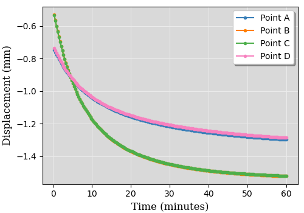

Input File
----------
The SafeInCave simulator runs entirely based on a single input file in JSON format. This file can be either created manually or with the help of class **InputFileAssistant**. The input file requires the following sections:

1. *grid*
2. *output*
3. *solver_settings*
4. *simulation_settings*
5. *body_force*
6. *time_settings*
7. *boundary_conditions*
8. *constitutive_model*

Therefore, the input file should have the basic structure shown below.

.. code-block:: json

    {
        "grid": {},
        "output": {},
        "solver_settings": {},
        "time_settings": {},
        "simulation_settings": {},
        "body_force": {},
        "boundary_conditions": {},
        "constitutive_model": {}
    }

A detailed explanation of each section is presented next.

Section *grid*
~~~~~~~~~~~~~~
The section grid informs the grid to be used in the simulation. This section requires two keys: (1) *path* and (2) *name*. The key path specifies the relative path to the directory where the grid stored. The key *name* indicates the name of the grid files, which is usually *geom* (e.g. *geom.xml*, *geom_facet_region.msh*, *geom_physical_region.xml*). The snippet :numref:`Listing %s <grid-section>` illustrates a typical example.

.. _grid-section:

.. code-block:: json
    :caption: Input file section: *grid*.

    {
        "grid": {
            "path": "../../grids/cube_0",
            "name": "geom"
        },
    }

Section *output*
~~~~~~~~~~~~~~~~
The section *output* only requires the key *path*, which is specifies the relative path to the directory where the output files will be saved. This is illustrated in :numref:`Listing %s <output-section>`, where the results are saved in the directory *output/case_name*. This directory is automatically created in case it does not exist.

.. _output-section:

.. code-block:: json
    :caption: Input file section: *output*

    {
        "output": {
            "path": "output/case_name"
         },
    }

Section *solver_settings*
~~~~~~~~~~~~~~~~~~~~~~~~~
This section specifies which solver is used to solve the linear systems. The required keys for *solver_settings* are *type* and *method*. The *type* key can be either *LU* or *KrylovSolver*, for direct LU decomposition of a Krylov-based solver, respectively. If *LU* is chosen, the *method* key can be either *default*, *umfpack*, *mumps*, *pastix*, *superlu*, *superlu_dist*, or *petsc*, dependint on how PETSc has been installed. For example,

.. _solver-settings-lu:

.. code-block:: json
    :caption: Input file section: *solver_settings* (LUSolver)

    {
        "solver_settings": {
            "type": "LU",
            "method": "petsc"
         },
    }

A Krylov-based solver can be chosen by specifying the keyword *KrylovSolver* to the *type* key. The specific Krylov solver is defined under the key *method*, and the main options are: *cg*, *bicg*, *bigcstab*, and *gmres*. In addition to *type* and *method*, the *KrylovSolver* requires keys *preconditioner* and *relative_tolerance*. The main options for key *preconditioner* are: *icc*, *ilu*, *petsc_amg*, *sor*, and *hypre*. For example,

.. _solver-settings-krylov:

.. code-block:: json
    :caption: Input file section: *solver_settings* (KrylovSolver)

    {
        "solver_settings": {
            "type": "KrylovSolver",
            "method": "cg",
            "preconditioner": "petsc_amg",
            "relative_tolerance": 1e-12
         },
    }

Section *simulation_settings*
~~~~~~~~~~~~~~~~~~~~~~~~~~~~~
This section specifies whether or not to compute the equilibrium condition before the actual simulation begins. It requires the *equilibrium* and *operation* keys, which specifies the settings for the equilibrium and operation simulation stages, respectively. In the equilibrium condition, the stresses specified at the initial time :math:`t=0` are applied to the geometry and a simulation is run considering only the **elastic** and **viscoelastic** (if present) part of the constitutive model. This equilibrium simulation is run until the it reaches steady-state condition. The keyword *true* or *false* specify whether the equilibrium condition is computed or not. The key *dt_max* specifies the time step size adopted to reach steady-state condition, which is defined by the *time_tol* key.

The *operation* key requires the key *active*, which can be *true* or *false*. The *dt_max* key defines the time step size of the simulation during the operation stage. Finally the *n_skip* key specifies how many time steps to skip before saving the results. This is useful in simulations where a very small time step size is required, thus avoiding excessively large results files. An example is shown in :numref:`Listing %s <simulation-settings>`.

.. _simulation-settings:

.. code-block:: json
    :caption: Input file section: *simulation_settings*

    {
        "simulation_settings": {
           "equilibrium": {
               "active": true,
               "dt_max": 1800.0,
               "time_tol": 0.0001
           },
           "operation": {
               "active": true,
               "dt_max": 1800.0,
               "n_skip": 1
           }
        },
    }

Section *body_forces*
~~~~~~~~~~~~~~~~~~~~~
This section defines the body forces associated to the rock mass. The gravity acceleration is specified under the key *gravity*; the rock density is defined under key *ensity*; and the direction along which the gravity acceleration is aligned is specified under the key *direction* (0 for *x*, 1 for *y* and 2 for *z*). For example, :numref:`Listing %s <body-force>`.

.. _body-force:

.. code-block:: json
    :caption: Input file section: *body_force*

    {
        "body_force": {
            "gravity": -9.81,
            "density": 2000,
            "direction": 2
        },
    }

.. _time-settings:

Section *time_settings*
~~~~~~~~~~~~~~~~~~~~~~~
In the *time_settings* section, the time integration method is defined by chosing the :math:`\theta` value under the key *theta* (0 for fully-implicit, 0.5 for Crank-Nicolson, and 1 for explicit). Next, the key *timeList* specifies the time schedule that defines the loading conditions (see :ref:`section-boundary-conditions`). For example,

.. _time-settings-section:

.. code-block:: json
    :caption: Input file section: *time_settings*

    {
        "time_settings": {
            "theta": 0.0,
            "time_list": [0, 10, 20]
        },
    }

.. _section-boundary-conditions:

Section *boundary_conditions*
~~~~~~~~~~~~~~~~~~~~~~~~~~~~~
This section allows for specifying the boundary conditions of the problem. For salt cavern simulations, it is often the case that the pressure inside the cavern varies with time. Additionally, for very tall caverns, there is a significant pressure difference between the top and the bottom of the cavern due to the gas specific weight. The sideburden, althought fixed in time, also varies significantly from top to bottom of the geometry. The section *boundary_conditions* was designed to allow for an easy spefication of such boundary conditions. To exemplify this process, consider the examples illustrated in :numref:`Fig. %s <bc-block-full>`, which shows a 2D view of a block with boundaries names *BOTTOM*, *TOP*, *WEST* and *EAST*. :numref:`Fig. %s <bc-block-full>`-a shows in details the boundary conditions applied at the initial time step :math:`t_0`. As it can be verified, the *BOTTOM* and *WEST* boundaries are prevented from normal displacement (Dirichlet boundary condition), whereas the *TOP* boundary is subjected to a constant (in space) compressive load, and a *z*-dependent load is applied to boundary *EAST*. Moreover, :numref:`Fig. %s <bc-block-full>`-b shows that the applied loads actually vary with time.

.. _bc-block-full:

.. figure:: _static/bc_block_full.png
   :alt: block
   :align: center
   :width: 90%

   Boundary conditions applied to block.

The keys inside the *boundary_settings* section must be the boundary names. Inside each boundary name, there is a *type* key that can be either *dirichlet* or *neumann*. If *type* is *dirichlet, then the imposed displacement component must be specified under the key *component* (0 for *x*, 1 for *y* and 2 for *z*). Next, the key *values* receives a list of prescribed values for each time level according to the *time_list*, defined in section *time_settings* (**both lists must be the same size**). If *type* is *neumann*, then the keys *direction*, *density*, *reference_position* and *values* are required. The *direction* key defines the direction along which the boundary condition varies spacially; the *density* key specifies how much the load changes in that direction; the *reference_position* key defines the position :math:`H` where the specified values :math:`p_0` are located (see :numref:`Fig. %s <bc-block-full>`-a); and the *values* key receives a list of prescribed loads corresponding to each time of *time_settings*.

The boundary conditions illustrated in :numref:`Fig. %s <bc-block-full>` are written in the JSON file as shown below (:numref:`Listing %s <boundary-conditions>`). The *BOTTOM* and *WEST* boundaries are of type *dirichlet* with value 0 in the time interval between 0 and 20 s (see :ref:`time-settings`). The displacement component normal to boundary *BOTTOM* is in the *z* direction, that is why the key *component* receives the value 2. On the other hand, the normal displacement on boundary *WEST* is aligned to the *x* direction, thus the value 0 to the key *component*. The boundary *EAST* is subjected to a boundary condition of *type* *neumann*, and the spatial variation takes place in the *z* direction (*direction: 2*). The amount of variation :math:`\rho` is specified as *density: 50* and the reference position :math:`H` is *reference_position: 1.0*, according to :numref:`Fig. %s <bc-block-full>`-a. According to :numref:`Fig. %s <bc-block-full>`-a, the load imposed on the *TOP* boundary is uniform, so the *density* key should be zero. As a consequence, the value specified in the *direction* and *reference_position* keys and do not matter at all.

.. note::
    
    The value of gravity :math:`g` shown in :numref:`Fig. %s <bc-block-full>`-a is specified in :ref:`body-force`.

.. _boundary-conditions:

.. code-block:: json
    :caption: Input file section: *boundary_conditions*

    {
        "boundary_conditions": {
            "BOTTOM": {
                "type": "dirichlet",
                "component": 2,
                "values": [0.0, 0.0, 0.0]
            },
            "WEST": {
                "type": "dirichlet",
                "component": 0,
                "values": [0.0, 0.0, 0.0]
            },
            "EAST": {
                "type": "neumann",
                "density": 50.0,
                "direction": 2,
                "reference_position": 1.0,
                "values": [5.0, 7.0, 10.0]
            },
            "TOP": {
                "type": "neumann",
                "density": 0.0,
                "direction": 0,
                "reference_position": 0.0,
                "values": [5.0, 8.0, 5.0]
            }
        }
    }

Section *constitutive_model*
~~~~~~~~~~~~~~~~~~~~~~~~~~~~

The SafeInCave simulator allows for very flexible choices of the constitutive model. As an example, we consider the constitutive model illustrated in :numref:`Fig. %s <constitutive-model-0>`, which is composed of a linear spring element, two Kelvin-Voigt elements, one viscoplastic element, and one dislocation creep element. Each one of these elements comprise its own set of material parameters, as indicated in the figure. Refer to :ref:`constitutive-models-section` for a detailed explanation of each element and the corresponding material properties.

.. _constitutive-model-0:

.. figure:: _static/constitutive_model_0.png
   :alt: block
   :align: center
   :width: 75%

   Elements composing the constitutive model.

To be general, let us consider a simple mesh divided in two sub-domains with different material properties. This is illustrated in :numref:`Fig. %s <mesh-regions>`, where elements 0, 1, 4 and 5 belong to :math:`\Omega_A`, while elements 2, 3, 6 and 7 belong to :math:`\Omega_B`.

.. note::

    A 2D grid is considered here only for simplicity. However, the SafeInCave simulator only handles 3D grids composed of tetrahedral elements.

.. _mesh-regions:

.. figure:: _static/mesh_regions.png
   :alt: block
   :align: center
   :width: 35%

   Computational mesh divided in two sub-domains: :math:`\Omega_A` and :math:`\Omega_B`.

The material properties assigned to each sub-domain is presented in :numref:`Table %s <table-mat-props>`. In this example, the values assigned to each material property are merely illustrative and **do not** correspond real physical values.

.. _table-mat-props:

.. list-table:: Material properties for domains :math:`\Omega_A` and :math:`\Omega_B`.
   :widths: 25 25 25
   :header-rows: 1

   * - Property name
     - Domain :math:`\Omega_A`
     - Domain :math:`\Omega_B`
   * - :math:`E_0`
     - 100
     - 250
   * - :math:`\nu_0`
     - 0.3
     - 0.2
   * - :math:`E_1`
     - 90
     - 75
   * - :math:`\nu_1`
     - 0.15
     - 0.42
   * - :math:`\eta_1`
     - 7.0
     - 8.2
   * - :math:`E_2`
     - 120
     - 165
   * - :math:`\nu_2`
     - 0.24
     - 0.38
   * - :math:`\eta_2`
     - 17.0
     - 6.3
   * - :math:`\mu_1`
     - 5.3
     - 2.1
   * - :math:`N_1`
     - 3.1
     - 2.9
   * - :math:`n`
     - 3
     - 3
   * - :math:`a_1`
     - 1.9
     - 2.3
   * - :math:`\eta`
     - 0.82
     - 0.97
   * - :math:`\beta`
     - 0.99
     - 0.76
   * - :math:`\beta_1`
     - 0.38
     - 0.75
   * - :math:`m`
     - -0.5
     - -0.5
   * - :math:`\gamma`
     - 0.087
     - 0.095
   * - :math:`\alpha_0`
     - 0.40
     - 0.27
   * - :math:`k_v`
     - 0.0
     - 0.6
   * - :math:`\sigma_t`
     - 5.0
     - 4.2
   * - :math:`A_1`
     - 1.9
     - 2.3
   * - :math:`n_1`
     - 3.1
     - 4.2
   * - :math:`T`
     - 298
     - 298
   * - :math:`Q`
     - 51600
     - 51600
   * - :math:`R`
     - 8.32
     - 8.32

The *constitutive_model* section requires three mandatory keys: *Elastic*, *Viscoelastic* and *Inelastic*. A spring can be added to the *Elastic* key as shown in :numref:`Listing %s <constitutive-model>`. The name *Spring0* is an arbitrary name given to the spring; the *type* key must be *Spring*; the key *active* can be *true* or *false* depending on whether the user wants to include it or not to the constitutive model; finally, the key *parameters* contains the lists of the material parameters associated to the spring (i.e. Young's modulus, :math:`E`, and Poisson's ratio, :math:`\nu`). The size of these lists must be the same as the number of grid elements (in this case, 8 elements, as shown in :numref:`Fig. %s <mesh-regions>`). Therefore, the values in these lists represent the material properties of each element of the grid.

.. important::

    A constitutive model **must** include at least one spring. In other words, at least one spring must be **active**.

A Kelvin-Voigt element is a parallel arrangement between a linear spring and a linear dashpot. This type of element is added under the key *Viscoelastic*. In the example shown in :numref:`Listing %s <constitutive-model>`, two Kelvin-Voigt elements are added, namely, *KelvinVoigt1* and *KelvinVoigt2*. The key *type* must be *KelvinVoigt*. The material parameters associated to the Kelvin-Voigt element are the Poisson's ratio (:math:`\nu`) and Young's modulus (:math:`E`) of the spring, and the viscosity (:math:`\eta`) of the dashpot.

.. note::

    A Kelvin-Voigt element with a nonlinear dashpot, if implemented, should be also added under the *Viscoelastic* key.

The viscoplastic and dislocation creep elements in :numref:`Fig. %s <constitutive-model-0>` must be included under the *Inelastic* key. In this example, the arbitrary names given to the viscoplastic and dislocation creep elements are *ViscPlastDesai* and *DisCreep*, respectively. The viscoplastic element must be of type *ViscoplasticDesai* and dislocation creep element must be of type *DislocationCreep*.

.. _constitutive-model:

.. code-block:: json
    :caption: Input file section: *constitutive_model*

    {
        "constitutive_model": {
            "Elastic": {
                "Spring0": {
                    "type": "Spring",
                    "active": true,
                    "parameters": {
                        "E": [100, 100, 250, 250, 100, 100, 250, 250],
                        "nu": [0.3, 0.3, 0.2, 0.2, 0.3, 0.3, 0.2, 0.2]
                    }
                }
            },
            "Viscoelastic": {
                "KelvinVoigt1": {
                    "type": "KelvinVoigt",
                    "active": true,
                    "parameters": {
                        "E": [90.0, 90.0, 75.0, 75.0, 90.0, 90.0, 75.0, 75.0],
                        "nu": [0.15, 0.15, 0.42, 0.42, 0.15, 0.15, 0.42, 0.42],
                        "eta": [7.0, 7.0, 8.2, 8.2, 7.0, 7.0, 8.2, 8.2]
                    }
                },
                "KelvinVoigt2": {
                    "type": "KelvinVoigt",
                    "active": true,
                    "parameters": {
                        "E": [120.0, 120.0, 165.0, 165.0, 120.0, 120.0, 165.0, 165.0],
                        "nu": [0.24, 0.24, 0.38, 0.38, 0.24, 0.24, 0.38, 0.38],
                        "eta": [17.0, 17.0, 6.3, 6.3, 17.0, 17.0, 6.3, 6.3]
                    }
                }
            },
            "Inelastic": {
                "ViscPlastDesai": {
                    "type": "ViscoplasticDesai",
                    "active": true,
                    "parameters": {
                        "mu_1": [5.3, 5.3, 2.1, 2.1, 5.3, 5.3, 2.1, 2.1],
                        "N_1": [3.1, 3.1, 2.9, 2.9, 3.1, 3.1, 2.9, 2.9],
                        "n": [3, 3, 3, 3, 3, 3, 3, 3],
                        "a_1": [1.9, 1.9, 2.3, 2.3, 1.9, 1.9, 2.3, 2.3],
                        "eta": [0.82, 0.82, 0.97, 0.97, 0.82, 0.82, 0.97, 0.97],
                        "beta_1": [0.99, 0.99, 0.76, 0.76, 0.99, 0.99, 0.76, 0.76],
                        "beta": [0.38, 0.38, 0.75, 0.75, 0.38, 0.38, 0.75, 0.75],
                        "m": [-0.5, -0.5, -0.5, -0.5, -0.5, -0.5, -0.5, -0.5],
                        "gamma": [0.087, 0.087, 0.095, 0.095, 0.087, 0.087, 0.095, 0.095],
                        "alpha_0": [0.40, 0.40, 0.27, 0.27, 0.40, 0.40, 0.27, 0.27],
                        "k_v": [0.0, 0.0, 0.6, 0.6, 0.0, 0.0, 0.6, 0.6],
                        "sigma_t": [5.0, 5.0, 4.2, 4.2, 5.0, 5.0, 4.2, 4.2]
                    }
                },
                "DisCreep": {
                    "type": "DislocationCreep",
                    "active": true,
                    "parameters": {
                        "A": [1.9, 1.9, 2.3, 2.3, 1.9, 1.9, 2.3, 2.3],
                        "n": [3.1, 3.1, 4.2, 4.2, 3.1, 3.1, 4.2, 4.2],
                        "T": [298, 298, 298,298, 298, 298, 298,298],
                        "Q": [51600, 51600, 51600, 51600, 51600, 51600, 51600, 51600],
                        "R": [832, 832, 832, 832, 832, 832, 832, 832]
                    }
                }
            }
        }
    }

The elements available for composing the constitutive model are summarized in :numref:`Table %s <list-elements>`, where the correspoding material parameters are also shown. The parameters, as discussed above, must be informed as a list of values associated to each grid element. Currently, the linear elastic spring, the viscoelastic Kelvin-Voigt element, the viscoplastic model of Desai (1987), and the dislocation creep element are implemented in the SafeInCave simulator.

.. _list-elements:

.. list-table:: Available elements for the constitutive model.
   :widths: 5 8 25
   :header-rows: 1

   * - Category
     - Type
     - Material parameters
   * - Elastic
     - Spring
     - E, nu
   * - Viscoelastic
     - KelvinVoigt
     - E, nu, eta
   * - Inelastic
     - DislocationCreep
     - A, n, T, Q, R
   * - Inelastic
     - ViscoplasticDesai
     - mu_1, N_1, n, a_1, eta, beta_1, beta, m, gamma, alpha_0, k_v, sigma_t

Full input file
~~~~~~~~~~~~~~~

To conclude this section, the complete input file should look like as in :numref:`Listing %s <full-input-file>`

.. _full-input-file:

.. code-block:: json
    :caption: Complete input file

    {
        "grid": {
            "path": "../../grids/cube_0",
            "name": "geom"
        },
        "output": {
            "path": "output/case_name"
         },
        "solver_settings": {
            "type": "KrylovSolver",
            "method": "cg",
            "preconditioner": "petsc_amg",
            "relative_tolerance": 1e-12
         },
        "simulation_settings": {
            "equilibrium": {
               "active": true,
               "dt_max": 1800.0,
               "time_tol": 0.0001
            },
            "operation": {
               "active": true,
               "dt_max": 1800.0,
               "n_skip": 1
            }
        },
        "body_force": {
            "gravity": -9.81,
            "density": 2000,
            "direction": 2
        },
        "time_settings": {
            "theta": 0.0,
            "time_list": [0, 10, 20]
        },
        "boundary_conditions": {
            "BOTTOM": {
                "type": "dirichlet",
                "component": 2,
                "values": [0.0, 0.0, 0.0]
            },
            "WEST": {
                "type": "dirichlet",
                "component": 0,
                "values": [0.0, 0.0, 0.0]
            },
            "EAST": {
                "type": "neumann",
                "density": 50.0,
                "direction": 2,
                "reference_position": 1.0,
                "values": [5.0, 7.0, 10.0]
            },
            "TOP": {
                "type": "neumann",
                "density": 0.0,
                "direction": 0,
                "reference_position": 0.0,
                "values": [5.0, 8.0, 5.0]
            }
        },
        "constitutive_model": {
            "Elastic": {
                "Spring0": {
                    "type": "Spring",
                    "active": true,
                    "parameters": {
                        "E": [100, 100, 250, 250, 100, 100, 250, 250],
                        "nu": [0.3, 0.3, 0.2, 0.2, 0.3, 0.3, 0.2, 0.2]
                    }
                }
            },
            "Viscoelastic": {
                "KelvinVoigt1": {
                    "type": "KelvinVoigt",
                    "active": true,
                    "parameters": {
                        "E": [90.0, 90.0, 75.0, 75.0, 90.0, 90.0, 75.0, 75.0],
                        "nu": [0.15, 0.15, 0.42, 0.42, 0.15, 0.15, 0.42, 0.42],
                        "eta": [7.0, 7.0, 8.2, 8.2, 7.0, 7.0, 8.2, 8.2]
                    }
                },
                "KelvinVoigt2": {
                    "type": "KelvinVoigt",
                    "active": true,
                    "parameters": {
                        "E": [120.0, 120.0, 165.0, 165.0, 120.0, 120.0, 165.0, 165.0],
                        "nu": [0.24, 0.24, 0.38, 0.38, 0.24, 0.24, 0.38, 0.38],
                        "eta": [17.0, 17.0, 6.3, 6.3, 17.0, 17.0, 6.3, 6.3]
                    }
                }
            },
            "Inelastic": {
                "ViscPlastDesai": {
                    "type": "ViscoplasticDesai",
                    "active": true,
                    "parameters": {
                        "mu_1": [5.3, 5.3, 2.1, 2.1, 5.3, 5.3, 2.1, 2.1],
                        "N_1": [3.1, 3.1, 2.9, 2.9, 3.1, 3.1, 2.9, 2.9],
                        "n": [3, 3, 3, 3, 3, 3, 3, 3],
                        "a_1": [1.9, 1.9, 2.3, 2.3, 1.9, 1.9, 2.3, 2.3],
                        "eta": [0.82, 0.82, 0.97, 0.97, 0.82, 0.82, 0.97, 0.97],
                        "beta_1": [0.99, 0.99, 0.76, 0.76, 0.99, 0.99, 0.76, 0.76],
                        "beta": [0.38, 0.38, 0.75, 0.75, 0.38, 0.38, 0.75, 0.75],
                        "m": [-0.5, -0.5, -0.5, -0.5, -0.5, -0.5, -0.5, -0.5],
                        "gamma": [0.087, 0.087, 0.095, 0.095, 0.087, 0.087, 0.095, 0.095],
                        "alpha_0": [0.40, 0.40, 0.27, 0.27, 0.40, 0.40, 0.27, 0.27],
                        "k_v": [0.0, 0.0, 0.6, 0.6, 0.0, 0.0, 0.6, 0.6],
                        "sigma_t": [5.0, 5.0, 4.2, 4.2, 5.0, 5.0, 4.2, 4.2]
                    }
                },
                "DisCreep": {
                    "type": "DislocationCreep",
                    "active": true,
                    "parameters": {
                        "A": [1.9, 1.9, 2.3, 2.3, 1.9, 1.9, 2.3, 2.3],
                        "n": [3.1, 3.1, 4.2, 4.2, 3.1, 3.1, 4.2, 4.2],
                        "T": [298, 298, 298,298, 298, 298, 298,298],
                        "Q": [51600, 51600, 51600, 51600, 51600, 51600, 51600, 51600],
                        "R": [832, 832, 832, 832, 832, 832, 832, 832]
                    }
                }
            }
        }
    }

Input file assistant
~~~~~~~~~~~~~~~~~~~~

One of the main difficults to manually write the input file is to assign the material properties for meshes that depend on many elements (unlike the hypothetical example shown in :numref:`Listing %s <full-input-file>`, where only 8 elements compose the mesh). For example, if we decide to replace the mesh in section *grid* by another mesh with different number of elements, the lists of material properties must be updated accordingly. Moreover, for complex loading schedules (sections *time_settings* and *boundary_conditions*), writing the time list and boundary conditions can easily become a very tedious task. Finally, manually writing the input file is always prone to errors.

Therefore, although the input file can be manually built, most of the time it will be more convenient to write the input file in an automatic manner. This can be achieved with class **InputFileAssistant** (check :ref:`input-file-assistant`), as presented below.

Import modules.

.. code-block:: python

    import os
    import sys
    import numpy as np
    sys.path.append(os.path.join("..", "..", "safeincave"))
    from Grid import GridHandlerGMSH
    from InputFileAssistant import BuildInputFile

Define some useful units for convenience.

.. code-block:: python

    hour = 60*60
    day = 24*hour
    MPa = 1e6

Initialize the input file assistant object.

.. code-block:: python

    bif = BuildInputFile()

Create *input_grid* section.

.. code-block:: python

    path_to_grid = os.path.join("..", "..", "grids", "cube_2regions")
    bif.section_input_grid(path_to_grid, "geom")

Create *output* section.

.. code-block:: python

    bif.section_output(os.path.join("output", "case_1"))

Create *solver_settings* section.

.. code-block:: python

    solver_settings = {
        "type": "KrylovSolver",
        "method": "cg",
        "preconditioner": "petsc_amg",
        "relative_tolerance": 1e-12,
    }
    bif.section_solver(solver_settings)

Create *simulation_settings* section.

.. code-block:: python

    bif.section_simulation(
        simulation_settings = {
            "equilibrium": {
                "active": True,
                "dt_max": 0.5*hour,
                "time_tol": 1e-4
            },
            "operation": {
                "active": True,
                "dt_max": 0.5*hour,
                "n_skip": 1
            }
        }
    )

Create *body_forces* section.

.. code-block:: python

    salt_density = 2000
    bif.section_body_forces(value=salt_density, direction=2)

Create *time_settings* section.

.. code-block:: python

    time_list = [0*hour,  2*hour,  10*hour, 12*hour, 14*hour, 16*hour, 20*hour, 22*hour, 24*hour]
    bif.section_time(time_list, theta=0.0)

Create *boundary_conditions* section.

.. code-block:: python

    bif.section_boundary_conditions()

    # Add Dirichlet boundary conditions
    bif.add_boundary_condition(
        boundary_name = "WEST",
        bc_data = {
            "type": "dirichlet",
            "component": 0,
            "values": list(np.zeros(len(time_list)))
        }
    )
    bif.add_boundary_condition(
        boundary_name = "SOUTH",
        bc_data = {
            "type": "dirichlet",
            "component": 1,
            "values": list(np.zeros(len(time_list)))
        }
    )
    bif.add_boundary_condition(
        boundary_name = "BOTTOM",
            bc_data = {
            "type": "dirichlet",
            "component": 2,
            "values": list(np.zeros(len(time_list)))
        }
    )

    # Add Neumann boundary condition
    bif.add_boundary_condition(
        boundary_name = "EAST",
        bc_data = {
            "type": "neumann",
            "direction": 2,
            "density": 0*salt_density,
            "reference_position": 1.0,
            "values": [5*MPa, 5*MPa, 5*MPa, 5*MPa, 5*MPa, 5*MPa, 5*MPa, 5*MPa, 5*MPa]
        }
    )
    bif.add_boundary_condition(
        boundary_name = "NORTH",
        bc_data = {
            "type": "neumann",
            "direction": 2,
            "density": 0*salt_density,
            "reference_position": 1.0,
            "values": [5*MPa, 5*MPa, 5*MPa, 5*MPa, 5*MPa, 5*MPa, 5*MPa, 5*MPa, 5*MPa]
        }
    )
    bif.add_boundary_condition(
        boundary_name = "TOP",
        bc_data = {
            "type": "neumann",
            "direction": 2,
            "density": 0.0,
            "reference_position": 1.0,
            "values": [6*MPa, 10*MPa, 10*MPa, 6*MPa, 6*MPa, 12*MPa, 12*MPa, 6*MPa, 6*MPa]
        }
    )

Create *constitutive_model* section.

.. code-block:: python

    bif.section_constitutive_model()

    # Add elastic properties
    bif.add_elastic_element(    
        element_name = "Spring_0", 
        element_parameters = {
            "type": "Spring",
            "active": True,
            "parameters": {
                "E":  list(102e9*np.ones(bif.n_elems)),
                "nu": list(0.3*np.ones(bif.n_elems))
            }
        }
    )

    # Add viscoelastic properties
    bif.add_viscoelastic_element(   
        element_name = "KelvinVoigt_0", 
        element_parameters = {
            "type": "KelvinVoigt",
            "active": True,
            "parameters": {
                "E":   list(10e9*np.ones(bif.n_elems)),
                "nu":  list(0.32*np.ones(bif.n_elems)),
                "eta": list(105e11*np.ones(bif.n_elems))
            }
        }
    )

    # Add viscoplastic parameters
    bif.add_inelastic_element(  
        element_name = "desai", 
        element_parameters = {
            "type": "ViscoplasticDesai",
            "active": False,
            "parameters": {
                "mu_1":     list(5.3665857009859815e-11*np.ones(bif.n_elems)),
                "N_1":      list(3.1*np.ones(bif.n_elems)),
                "n":        list(3.0*np.ones(bif.n_elems)),
                "a_1":      list(1.965018496922832e-05*np.ones(bif.n_elems)),
                "eta":      list(0.8275682807874163*np.ones(bif.n_elems)),
                "beta_1":   list(0.0048*np.ones(bif.n_elems)),
                "beta":     list(0.995*np.ones(bif.n_elems)),
                "m":        list(-0.5*np.ones(bif.n_elems)),
                "gamma":    list(0.095*np.ones(bif.n_elems)),
                "alpha_0":  list(0.0040715714049800586*np.ones(bif.n_elems)),
                "k_v":      list(0.0*np.ones(bif.n_elems)),
                "sigma_t":  list(5.0*np.ones(bif.n_elems))
            }
        }
    )

    # Add dislocation creep parameters
    bif.add_inelastic_element(  
        element_name = "creep", 
        element_parameters = {
            "type": "DislocationCreep",
            "active": True,
            "parameters": {
                "A":    list(1.9e-20*np.ones(bif.n_elems)),
                "n":    list(3.0*np.ones(bif.n_elems)),
                "T":    list(298*np.ones(bif.n_elems)),
                "Q":    list(51600*np.ones(bif.n_elems)),
                "R":    list(8.32*np.ones(bif.n_elems))
            }
        }
    )

Save input_file.json.

.. code-block:: python

    bif.save_input_file("input_file.json")

Defining a simulation is just a matter of chosing a mesh for the problem (with the desired geometry, boundary and region names) and appropriately writing the input file. 

Tutorial 1
----------

Build input file
~~~~~~~~~~~~~~~~

.. code-block:: python

    import os
    import json
    import sys
    import numpy as np
    sys.path.append(os.path.join("..", "..", "safeincave"))
    from Grid import GridHandlerGMSH
    from InputFileAssistant import BuildInputFile
    import dolfin as do

.. code-block:: python

    # Useful units
    hour = 60*60
    day = 24*hour
    MPa = 1e6
    GPa = 1e9

.. code-block:: python

    # Initialize input file object
    ifa = BuildInputFile()

.. code-block:: python

    # Create input_grid section
    path_to_grid = os.path.join("..", "..", "grids", "cube_2regions")
    ifa.section_input_grid(path_to_grid, "geom")

.. code-block:: python

    # Create output section
    ifa.section_output(os.path.join("output", "case_0"))

.. code-block:: python

    # Create solver settings section
    solver_settings = {
        "type": "KrylovSolver",
        "method": "cg",
        "preconditioner": "petsc_amg",
        "relative_tolerance": 1e-12,
    }
    ifa.section_solver(solver_settings)

.. code-block:: python

    # Create simulation_settings section
    ifa.section_simulation(simulation_settings = {
                                "equilibrium": {
                                    "active": False,
                                    "dt_max": 0.5*hour,
                                    "time_tol": 1e-4
                                },
                                "operation": {
                                    "active": True,
                                    "dt_max": 0.005*hour,
                                    "n_skip": 1
                                }
                           })

.. code-block:: python

    # Create body_forces section
    salt_density = 2000
    ifa.section_body_forces(value=salt_density, direction=2)

.. code-block:: python

    # Create time_settings section
    time_list = [0*hour,  1*hour]
    ifa.section_time(time_list, theta=0.0)

.. code-block:: python

    # Create boundary_conditions section
    ifa.section_boundary_conditions()

    # Add Dirichlet boundary conditions
    ifa.add_boundary_condition(boundary_name = "WEST",
                               bc_data = {
                                        "type": "dirichlet",
                                        "component": 0,
                                        "values": list(np.zeros(len(time_list)))
                               }
    )
    ifa.add_boundary_condition(boundary_name = "SOUTH",
                               bc_data = {
                                        "type": "dirichlet",
                                        "component": 1,
                                        "values": list(np.zeros(len(time_list)))
                               }
    )
    ifa.add_boundary_condition(boundary_name = "BOTTOM",
                               bc_data = {
                                        "type": "dirichlet",
                                        "component": 2,
                                        "values": list(np.zeros(len(time_list)))
                               }
    )

    # Add Neumann boundary condition
    ifa.add_boundary_condition(boundary_name = "EAST",
                               bc_data = {
                                        "type": "neumann",
                                        "direction": 2,
                                        "density": 0*salt_density,
                                        "reference_position": 1.0,
                                        "values": [5*MPa, 5*MPa]
                               }
    )
    ifa.add_boundary_condition(boundary_name = "NORTH",
                               bc_data = {
                                        "type": "neumann",
                                        "direction": 2,
                                        "density": 0*salt_density,
                                        "reference_position": 1.0,
                                        "values": [5*MPa, 5*MPa]
                               }
    )
    ifa.add_boundary_condition(boundary_name = "TOP",
                               bc_data = {
                                        "type": "neumann",
                                        "direction": 2,
                                        "density": 0.0,
                                        "reference_position": 1.0,
                                        "values": [8*MPa, 8*MPa]
                                }
    )

.. code-block:: pycon
    
    >>> region_marker_A = ifa.grid.get_subdomain_tags("OMEGA_A")
    >>> print(region_marker_A)
    1
    >>> region_marker_B = ifa.grid.get_subdomain_tags("OMEGA_B")
    >>> print(region_marker_B)
    2

.. code-block:: python

    index_A = []
    index_B = []

    # Sweep over the grid regions and elements
    for cell in do.cells(ifa.grid.mesh):
        region_marker = ifa.grid.subdomains[cell]
        if region_marker == ifa.grid.get_subdomain_tags("OMEGA_A"):
            index_A.append(cell.index())
        elif region_marker == ifa.grid.get_subdomain_tags("OMEGA_B"):
            index_B.append(cell.index())
        else:
            raise Exception("Subdomain tag not valid. Check your mesh file.")

.. code-block:: python

    # Assign material properties
    ifa.section_constitutive_model()

.. code-block:: python

    # Add elastic properties
    E = np.zeros(ifa.n_elems)
    E[index_A] = 8*GPa
    E[index_B] = 10*GPa

    nu = np.zeros(ifa.n_elems)
    nu[index_A] = 0.2
    nu[index_B] = 0.3

    ifa.add_elastic_element(    element_name = "Spring_0", 
                                element_parameters = {  "type": "Spring",
                                                        "active": True,
                                                        "parameters": {
                                                            "E": list(E),
                                                            "nu": list(nu)
                                                        }
                                                    }
    )

.. code-block:: python
    
    # Add viscoelastic properties
    E[index_A] = 8*GPa
    E[index_B] = 5*GPa

    nu[index_A] = 0.35
    nu[index_B] = 0.28

    eta = np.zeros(ifa.n_elems)
    eta[index_A] = 105e11
    eta[index_B] = 38e11

    # Add viscoelastic properties
    ifa.add_viscoelastic_element(   element_name = "KelvinVoigt_0", 
                                    element_parameters = {
                                                            "type": "KelvinVoigt",
                                                            "active": True,
                                                            "parameters": {
                                                                "E":    list(E),
                                                                "nu":   list(nu),
                                                                "eta":  list(eta)
                                                            }
                                                        }
    )

.. code-block:: python

    # Save input_file.json
    ifa.save_input_file("input_file.json")

To visualize the results...

.. code-block:: python

    import os
    import sys
    sys.path.append(os.path.join("..", "..", "safeincave"))
    import numpy as np
    import pandas as pd
    import matplotlib.pyplot as plt
    from ResultsHandler import read_vector_from_points

    # Read displacement results
    pvd_path = os.path.join("output", "case_0", "operation", "vtk", "displacement")
    pvd_file = "displacement.pvd"
    df_coord, u, v, w = read_vector_from_points(pvd_path, pvd_file)

    point_A = df_coord[(df_coord["z"] == 1) & (df_coord["x"] == 0) & (df_coord["y"] == 0)].index[0]
    point_B = df_coord[(df_coord["z"] == 1) & (df_coord["x"] == 0) & (df_coord["y"] == 1)].index[0]
    point_C = df_coord[(df_coord["z"] == 1) & (df_coord["x"] == 1) & (df_coord["y"] == 1)].index[0]
    point_D = df_coord[(df_coord["z"] == 1) & (df_coord["x"] == 1) & (df_coord["y"] == 0)].index[0]
    print(point_A, point_B, point_C, point_D)

    w_A = w.iloc[point_A].values[1:]
    w_B = w.iloc[point_B].values[1:]
    w_C = w.iloc[point_C].values[1:]
    w_D = w.iloc[point_D].values[1:]

    t = w.iloc[point_A].index.values[1:]

    # Plot pressure schedule
    fig, ax = plt.subplots(1, 1, figsize=(5, 3.5))
    fig.subplots_adjust(top=0.970, bottom=0.135, left=0.140, right=0.980, hspace=0.35, wspace=0.225)

    ax.plot(t/60, w_A*1000, ".-", color="#377eb8", label="Point A")
    ax.plot(t/60, w_B*1000, ".-", color="#ff7f00", label="Point B")
    ax.plot(t/60, w_C*1000, ".-", color="#4daf4a", label="Point C")
    ax.plot(t/60, w_D*1000, ".-", color="#f781bf", label="Point D")
    ax.set_xlabel("Time (minutes)", size=12, fontname="serif")
    ax.set_ylabel("Displacement (mm)", size=12, fontname="serif")
    ax.grid(True)
    ax.legend(loc=0, shadow=True, fancybox=True)

    plt.show()

.. _tutorial-1-results-0:

