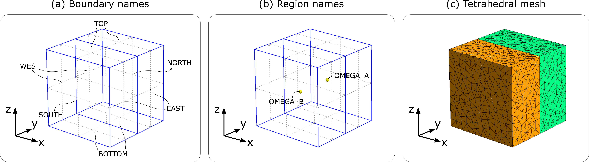
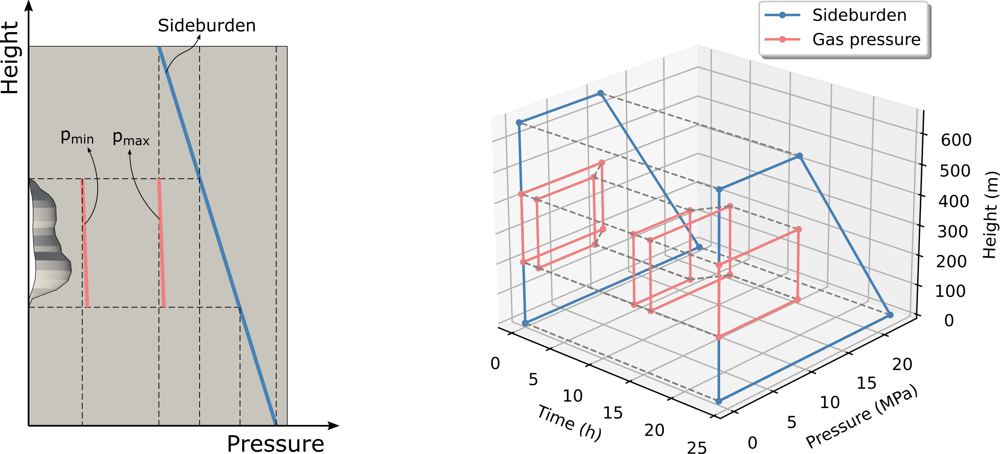

Tutorial 1
----------

.. tutorial-1-geom:

   Boundary names, region (subdomain) names and computational mesh.

Build input file
~~~~~~~~~~~~~~~~

.. code-block:: python
    :linenos:

    import os
    import json
    import sys
    import numpy as np
    sys.path.append(os.path.join("..", "..", "safeincave"))
    from Grid import GridHandlerGMSH
    from InputFileAssistant import BuildInputFile
    import dolfin as do

.. code-block:: python
    :linenos:

    # Useful units
    hour = 60*60
    day = 24*hour
    MPa = 1e6
    GPa = 1e9

.. code-block:: python
    :linenos:

    # Initialize input file object
    ifa = BuildInputFile()

.. code-block:: python
    :linenos:

    # Create input_grid section
    path_to_grid = os.path.join("..", "..", "grids", "cube_2regions")
    ifa.section_input_grid(path_to_grid, "geom")

.. code-block:: python
    :linenos:

    # Create output section
    ifa.section_output(os.path.join("output", "case_0"))

.. code-block:: python
    :linenos:

    # Create solver settings section
    solver_settings = {
        "type": "KrylovSolver",
        "method": "cg",
        "preconditioner": "petsc_amg",
        "relative_tolerance": 1e-12,
    }
    ifa.section_solver(solver_settings)

.. code-block:: python
    :linenos:

    # Create simulation_settings section
    ifa.section_simulation(simulation_settings = {
                                "equilibrium": {
                                    "active": False,
                                    "dt_max": 0.5*hour,
                                    "time_tol": 1e-4
                                },
                                "operation": {
                                    "active": True,
                                    "dt_max": 0.005*hour,
                                    "n_skip": 1
                                }
                           })

.. code-block:: python
    :linenos:

    # Create body_forces section
    salt_density = 2000
    ifa.section_body_forces(value=salt_density, direction=2)

.. code-block:: python
    :linenos:

    # Create time_settings section
    time_list = [0*hour,  1*hour]
    ifa.section_time(time_list, theta=0.0)

.. code-block:: python
    :linenos:

    # Create boundary_conditions section
    ifa.section_boundary_conditions()

    # Add Dirichlet boundary conditions
    ifa.add_boundary_condition(
        boundary_name = "WEST",
        bc_data = {
            "type": "dirichlet",
            "component": 0,
            "values": list(np.zeros(len(time_list)))
        }
    )
    ifa.add_boundary_condition(
        boundary_name = "SOUTH",
        bc_data = {
            "type": "dirichlet",
            "component": 1,
            "values": list(np.zeros(len(time_list)))
        }
    )
    ifa.add_boundary_condition(
        boundary_name = "BOTTOM",
        bc_data = {
            "type": "dirichlet",
            "component": 2,
            "values": list(np.zeros(len(time_list)))
        }
    )

    # Add Neumann boundary condition
    ifa.add_boundary_condition(
        boundary_name = "EAST",
        bc_data = {
            "type": "neumann",
            "direction": 2,
            "density": 0*salt_density,
            "reference_position": 1.0,
            "values": [5*MPa, 5*MPa]
        }
    )
    ifa.add_boundary_condition(
        boundary_name = "NORTH",
        bc_data = {
            "type": "neumann",
            "direction": 2,
            "density": 0*salt_density,
            "reference_position": 1.0,
            "values": [5*MPa, 5*MPa]
        }
    )
    ifa.add_boundary_condition(
        boundary_name = "TOP",
        bc_data = {
            "type": "neumann",
            "direction": 2,
            "density": 0.0,
            "reference_position": 1.0,
            "values": [8*MPa, 8*MPa]
        }
    )

.. code-block:: pycon
    
    >>> region_marker_A = ifa.grid.get_subdomain_tags("OMEGA_A")
    >>> print(region_marker_A)
    1
    >>> region_marker_B = ifa.grid.get_subdomain_tags("OMEGA_B")
    >>> print(region_marker_B)
    2

.. code-block:: python
    :linenos:

    index_A = []
    index_B = []

    # Sweep over the grid regions and elements
    for cell in do.cells(ifa.grid.mesh):
        region_marker = ifa.grid.subdomains[cell]
        if region_marker == ifa.grid.get_subdomain_tags("OMEGA_A"):
            index_A.append(cell.index())
        elif region_marker == ifa.grid.get_subdomain_tags("OMEGA_B"):
            index_B.append(cell.index())
        else:
            raise Exception("Subdomain tag not valid. Check your mesh file.")

.. code-block:: python
    :linenos:

    # Assign material properties
    ifa.section_constitutive_model()

.. code-block:: python
    :linenos:

    # Add elastic properties
    E = np.zeros(ifa.n_elems)
    E[index_A] = 8*GPa
    E[index_B] = 10*GPa

    nu = np.zeros(ifa.n_elems)
    nu[index_A] = 0.2
    nu[index_B] = 0.3

    ifa.add_elastic_element(
        element_name = "Spring_0", 
        element_parameters = {
            "type": "Spring",
            "active": True,
            "parameters": {
                "E": list(E),
                "nu": list(nu)
            }
        }
    )

.. code-block:: python
    :linenos:
    
    # Add viscoelastic properties
    E[index_A] = 8*GPa
    E[index_B] = 5*GPa

    nu[index_A] = 0.35
    nu[index_B] = 0.28

    eta = np.zeros(ifa.n_elems)
    eta[index_A] = 105e11
    eta[index_B] = 38e11

    # Add viscoelastic properties
    ifa.add_viscoelastic_element(
        element_name = "KelvinVoigt_0", 
        element_parameters = {
            "type": "KelvinVoigt",
            "active": True,
            "parameters": {
                "E":    list(E),
                "nu":   list(nu),
                "eta":  list(eta)
            }
        }
    )

.. code-block:: python
    :linenos:

    # Save input_file.json
    ifa.save_input_file("input_file.json")

To visualize the results...

.. code-block:: python
    :linenos:

    import os
    import sys
    sys.path.append(os.path.join("..", "..", "safeincave"))
    import numpy as np
    import pandas as pd
    import matplotlib.pyplot as plt
    from ResultsHandler import read_vector_from_points

    # Read displacement results
    pvd_path = os.path.join("output", "case_0", "operation", "vtk", "displacement")
    pvd_file = "displacement.pvd"
    df_coord, u, v, w = read_vector_from_points(pvd_path, pvd_file)

    point_A = df_coord[(df_coord["z"]==1) & (df_coord["x"]==0) & (df_coord["y"]==0)].index[0]
    point_B = df_coord[(df_coord["z"]==1) & (df_coord["x"]==0) & (df_coord["y"]==1)].index[0]
    point_C = df_coord[(df_coord["z"]==1) & (df_coord["x"]==1) & (df_coord["y"]==1)].index[0]
    point_D = df_coord[(df_coord["z"]==1) & (df_coord["x"]==1) & (df_coord["y"]==0)].index[0]
    print(point_A, point_B, point_C, point_D)

    w_A = w.iloc[point_A].values[1:]
    w_B = w.iloc[point_B].values[1:]
    w_C = w.iloc[point_C].values[1:]
    w_D = w.iloc[point_D].values[1:]

    t = w.iloc[point_A].index.values[1:]

    # Plot pressure schedule
    fig, ax = plt.subplots(1, 1, figsize=(5, 3.5))
    fig.subplots_adjust(
        top=0.970, bottom=0.135, left=0.140, right=0.980, hspace=0.35, wspace=0.225
    )

    ax.plot(t/60, w_A*1000, ".-", color="#377eb8", label="Point A")
    ax.plot(t/60, w_B*1000, ".-", color="#ff7f00", label="Point B")
    ax.plot(t/60, w_C*1000, ".-", color="#4daf4a", label="Point C")
    ax.plot(t/60, w_D*1000, ".-", color="#f781bf", label="Point D")
    ax.set_xlabel("Time (minutes)", size=12, fontname="serif")
    ax.set_ylabel("Displacement (mm)", size=12, fontname="serif")
    ax.grid(True)
    ax.legend(loc=0, shadow=True, fancybox=True)

    plt.show()

.. _tutorial-1-results-0:

.. figure:: _static/tutorial_1_results_0.png
   :alt: block
   :align: center
   :width: 50%

Tutorial 2
----------

.. _tutorial-2-loading-schedule:

Build input file
~~~~~~~~~~~~~~~~

.. code-block:: python
    :linenos:

    import os
    import sys
    import numpy as np
    sys.path.append(os.path.join("..", "..", "safeincave"))
    from Grid import GridHandlerGMSH
    from InputFileAssistant import BuildInputFile

.. code-block:: python
    :linenos:

    # Useful units
    hour = 60*60
    day = 24*hour
    MPa = 1e6

.. code-block:: python
    :linenos:

    # Initialize input file object
    bif = BuildInputFile()

    # Create input_grid section
    path_to_grid = os.path.join("..", "..", "grids", "cavern_irregular")
    bif.section_input_grid(path_to_grid, "geom")

    print(bif.grid.get_boundary_names())

.. code-block:: python
    :linenos:

    # Extract geometry dimensions
    Lx = bif.grid.Lx
    Ly = bif.grid.Ly
    Lz = bif.grid.Lz
    cavern_roof = 430

.. code-block:: python
    :linenos:

    # Create output section
    bif.section_output(os.path.join("output", "case_1"))

.. code-block:: python
    :linenos:

    # Create solver settings section
    solver_settings = {
        "type": "KrylovSolver",
        "method": "cg",
        "preconditioner": "petsc_amg",
        "relative_tolerance": 1e-12,
    }
    bif.section_solver(solver_settings)

.. code-block:: python
    :linenos:

    # Create simulation_settings section
    bif.section_simulation(
        simulation_settings = {
            "equilibrium": {
                "active": True,
                "dt_max": 0.5*hour,
                "time_tol": 1e-4
            },
            "operation": {
                "active": True,
                "dt_max": 0.1*hour,
                "n_skip": 2
            }
        }
    )

.. code-block:: python
    :linenos:

    # Create body_forces section
    salt_density = 2000
    bif.section_body_forces(value=salt_density, direction=2)

.. code-block:: python

    # Create time_settings section
    time_list = [0*hour,  2*hour,  14*hour, 16*hour, 24*hour]
    bif.section_time(time_list, theta=0.0)

.. code-block:: python
    :linenos:

    # Create boundary_conditions section
    bif.section_boundary_conditions()

    # Add Dirichlet boundary conditions
    bif.add_boundary_condition(
        boundary_name = "West",
        bc_data = {
            "type": "dirichlet",
            "component": 0,
            "values": list(np.zeros(len(time_list)))
        }
    )
    bif.add_boundary_condition(
        boundary_name = "South",
        bc_data = {
            "type": "dirichlet",
            "component": 1,
            "values": list(np.zeros(len(time_list)))
        }
    )
    bif.add_boundary_condition(
        boundary_name = "Bottom",
        bc_data = {
            "type": "dirichlet",
            "component": 2,
            "values": list(np.zeros(len(time_list)))
        }
    )

    # Add Neumann boundary condition
    bif.add_boundary_condition(
        boundary_name = "East",
        bc_data = {
            "type": "neumann",
            "direction": 2,
            "density": salt_density,
            "reference_position": Lz,
            "values": [10*MPa, 10*MPa, 10*MPa, 10*MPa, 10*MPa]
        }
    )

    bif.add_boundary_condition(
        boundary_name = "North",
        bc_data = {
            "type": "neumann",
            "direction": 2,
            "density": salt_density,
            "reference_position": Lz,
            "values": [10*MPa, 10*MPa, 10*MPa, 10*MPa, 10*MPa]
        }
    )

    bif.add_boundary_condition(
        boundary_name = "Top",
        bc_data = {
            "type": "neumann",
            "direction": 2,
            "density": 0.0,
            "reference_position": Lz,
            "values": [10*MPa, 10*MPa, 10*MPa, 10*MPa, 10*MPa]
        }
    )

    h2_density = 10
    bif.add_boundary_condition(
        boundary_name = "Cavern",
        bc_data = {
            "type": "neumann",
            "direction": 2,
            "density": h2_density,
            "reference_position": cavern_roof,
            "values": [10*MPa, 7*MPa, 7*MPa, 10*MPa, 10*MPa]
        }
    )

.. code-block:: python
    :linenos:

    # Assign material properties
    bif.section_constitutive_model()

    # Add elastic properties
    bif.add_elastic_element(    
        element_name = "Spring_0", 
        element_parameters = {
            "type": "Spring",
            "active": True,
            "parameters": {
                "E":  list(102e9*np.ones(bif.n_elems)),
                "nu": list(0.3*np.ones(bif.n_elems))
            }
        }
    )

    # Add viscoelastic properties
    bif.add_viscoelastic_element(   
        element_name = "KelvinVoigt_0", 
        element_parameters = {
            "type": "KelvinVoigt",
            "active": True,
            "parameters": {
                "E":   list(10e9*np.ones(bif.n_elems)),
                "nu":  list(0.32*np.ones(bif.n_elems)),
                "eta": list(105e11*np.ones(bif.n_elems))
            }
        }
    )

    # Add viscoplastic parameters
    bif.add_inelastic_element(  
        element_name = "desai", 
        element_parameters = {
            "type": "ViscoplasticDesai",
            "active": False,
            "parameters": {
                "mu_1":     list(5.3665857009859815e-11*np.ones(bif.n_elems)),
                "N_1":      list(3.1*np.ones(bif.n_elems)),
                "n":        list(3.0*np.ones(bif.n_elems)),
                "a_1":      list(1.965018496922832e-05*np.ones(bif.n_elems)),
                "eta":      list(0.8275682807874163*np.ones(bif.n_elems)),
                "beta_1":   list(0.0048*np.ones(bif.n_elems)),
                "beta":     list(0.995*np.ones(bif.n_elems)),
                "m":        list(-0.5*np.ones(bif.n_elems)),
                "gamma":    list(0.095*np.ones(bif.n_elems)),
                "alpha_0":  list(0.0022*np.ones(bif.n_elems)),
                "k_v":      list(0.0*np.ones(bif.n_elems)),
                "sigma_t":  list(5.0*np.ones(bif.n_elems))
            }
        }
    )

    # Add dislocation creep parameters
    bif.add_inelastic_element(  
        element_name = "creep", 
        element_parameters = {
            "type": "DislocationCreep",
            "active": True,
            "parameters": {
                "A": list(1.9e-20*np.ones(bif.n_elems)),
                "n": list(3.0*np.ones(bif.n_elems)),
                "T": list(298*np.ones(bif.n_elems)),
                "Q": list(51600*np.ones(bif.n_elems)),
                "R": list(8.32*np.ones(bif.n_elems))
            }
        }
    )

    # Save input_file.json
    bif.save_input_file("input_file.json")

Visualize results
~~~~~~~~~~~~~~~~~

.. code-block:: python
    :linenos:

    import os
    import sys
    sys.path.append(os.path.join("..", "..", "safeincave"))
    from ResultsHandler import convert_vtk_to_pandas
    import matplotlib.pyplot as plt
    import numpy as np
    import meshio

.. code-block:: python
    :linenos:

    minute = 60
    hour = 60*minute
    day = 24*hour
    MPa = 1e6

.. code-block:: python
    :linenos:

    def trapezoidal_volume(x, y):
        volume = 0.0
        area = 0.0
        n = len(x)
        for i in range(1, n):
            R = 0.5*(y[i] + y[i-1])
            A = np.pi*R**2
            d = x[i] - x[i-1]
            area += R*d
            volume += A*d
        return volume

.. code-block:: python
    :linenos:

    def reorder_data(df_coord, u, v, w, wall_ind):
        # Initial cavern shape
        x0 = df_coord.iloc[wall_ind]["x"]
        y0 = df_coord.iloc[wall_ind]["y"]
        z0 = df_coord.iloc[wall_ind]["z"]
        # Reorder all coordinates according to coordinate z
        sorted_z0_ind = z0.sort_values().index
        x0 = x0[sorted_z0_ind]
        y0 = y0[sorted_z0_ind]
        z0 = z0[sorted_z0_ind]
        # Reorder all displacements according to coordinate z
        u = u.iloc[wall_ind].loc[sorted_z0_ind]
        v = v.iloc[wall_ind].loc[sorted_z0_ind]
        w = w.iloc[wall_ind].loc[sorted_z0_ind]
        return x0, y0, z0, u, v, w

.. code-block:: python
    :linenos:

    # Create figure
    fig, (ax1, ax2) = plt.subplots(1, 2, figsize=(9, 3))
    fig.subplots_adjust(
        top=0.985, bottom=0.145, left=0.070, right=0.990, hspace=0.35, wspace=0.260
    )

.. code-block:: python
    :linenos:

    # Define folders
    results_folder = os.path.join("output", "case_0", "operation", "vtk")
    mesh_folder = os.path.join("..", "..", "grids", "cavern_regular")

.. code-block:: python
    :linenos:

    # Read displacement results
    pvd_path = os.path.join(results_folder, "displacement")
    pvd_file = "displacement.pvd"
    df_coord, u, v, w = convert_vtk_to_pandas(pvd_path, pvd_file)

.. code-block:: python
    :linenos:

    # Get indices of wall profile
    mesh = meshio.read(os.path.join(mesh_folder, "geom.msh"))
    wall_ind = np.unique(mesh.cells["line"].flatten())

.. code-block:: python
    :linenos:

    # Get reordered data over cavern wall
    x0, y0, z0, u, v, w = reorder_data(df_coord, u, v, w, wall_ind)

.. code-block:: python
    :linenos:

    # Get times
    times = u.columns.values
    t_final = times[-1]

.. code-block:: python
    :linenos:

    # Compute cavern volumes over time
    vol_0 = trapezoidal_volume(z0.values, x0.values)
    volumes = []
    for t in times[1:]:
        z = z0.values + w[t].values
        x = x0.values + u[t].values
        vol = trapezoidal_volume(z, x)
        volumes.append(100*abs(vol_0 - vol)/vol_0)

.. code-block:: python
    :linenos:

    # Plot cavern shape
    expansion_factor = 50
    xf = x0 + expansion_factor*u[t_final]
    yf = y0 + expansion_factor*v[t_final]
    zf = z0 + expansion_factor*w[t_final]
    ax1.plot(x0, z0, "-", color="black", linewidth=2.0, label="Initial shape")
    ax1.plot(-x0, z0, "-", color="black", linewidth=2.0)
    ax1.plot(xf, zf, "-", color="#377eb8", linewidth=2.0, label=f"Final shape")
    ax1.plot(-xf, zf, "-", color="#377eb8", linewidth=2.0)
    ax1.set_xlabel("x (m)", size=12, fontname="serif")
    ax1.set_ylabel("z (m)", size=12, fontname="serif")
    ax1.legend(loc=1, shadow=True, fancybox=True)
    ax1.axis("equal")
    ax1.grid(True, color='0.92')
    ax1.set_facecolor("0.85")

.. code-block:: python
    :linenos:

    # Plot cavern volumetric closure
    ax2.plot(times[2:]/hour, volumes[1:] - 0*volumes[1], ".-", color="#377eb8", linewidth="2.0")
    ax2.set_xlabel("Time (h)", size=12, fontname="serif")
    ax2.set_ylabel("Cavern closure (%)", size=12, fontname="serif")
    ax2.grid(True, color='0.92')
    ax2.set_facecolor("0.85")

.. code-block:: python

    plt.show()

.. _tutorial-2-results-0:

.. figure:: _static/tutorial_2_results_0.png
   :alt: block
   :align: center
   :width: 80%

   Initial and final cavern shape (left) and cavern volumetric closure (right).

