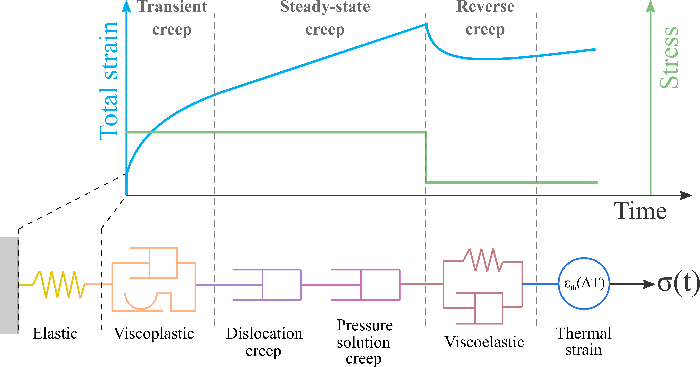

# Constitutive model

In general, a constitutive model can be represented as illustrated in Fig. 1, which shows a serial arrangement of different types of elements (springs, dashpots, etc). The total strain $\pmb{\varepsilon}$ is given by the sum of the individual strain of all elements composing the constitutive model. In this text, we make a distinction between **elastic**, **non-elastic**, and **thermal** strains.

{#fig-cavern-mesh width="80%"}

As shown in , the constitutive model consists of

vdvfds