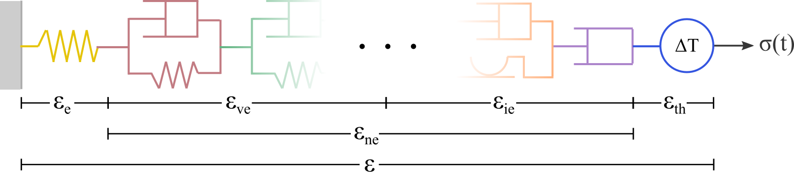

# Constitutive model

In general, a constitutive model can be represented as illustrated in , which shows a serial arrangement of different types of elements (springs, dashpots, etc). The total strain $\pmb{\varepsilon}$ is given by the sum of the individual strain of all elements composing the constitutive model. In this text, we make a distinction between **elastic**, **non-elastic**, and **thermal** strains.

{#fig-constitutive-model-0 width="80%"}

Elastic strains $\pmb{\varepsilon}_{e}$ refer exclusively to time-independent (instantaneous) elastic strains -- in other words, it only includes the deformation of the yellow spring in .

The non-elastic strains comprise the viscoelastic ($\pmb{\varepsilon}_{ve}$) and inelastic ($\pmb{\varepsilon}_{ie}$) strains. In the SafeInCave simulator, the only viscoelastic element implemented is the Kelvin-Voigt element, which is described below. For inelastic elements, the SafeInCave simulator provides three options: a viscoplastic element, a dislocation creep element, and a pressure solution creep element.

All these different types of elements can be arbitrarily combined as illustrated in .

{#fig-constitutive-model-1 width="80%"}

From the discussion above and from , it follows that the total strain can be written as

$$
\pmb{\varepsilon} = \pmb{\varepsilon}_e + \underbrace{\pmb{\varepsilon}_{ve} + \pmb{\varepsilon}_{ie}}_{\pmb{\varepsilon}_{ne}} + \pmb{\varepsilon}_{th}
$$

## Kelvin-Voigt element

The Kelvin-Voigt element consists of a parallel arrangement between a spring and a dashpot. The stress $\pmb{\sigma}$ applied on this type of element is balanced by the stresses on the spring and dashpot. That is,

$$
\pmb{\sigma} = \underbrace{\mathbb{C}_1 : \pmb{\varepsilon}_{ve}}_{\text{spring}} + \underbrace{\eta_1 \dot{\pmb{\varepsilon}}_{ve}}_{\text{dashpot}}
\label{eq:sigma_kelvin_0}
$$

where $\pmb{\varepsilon}_{ve}$ represents the strain of both spring and dashpot. Solving Eq. $\eqref{eq:sigma_kelvin_0}$ for the strain rate gives

$$
\dot{\pmb{\varepsilon}}_{ve} = \frac{1}{\eta_1} \left( \pmb{\sigma} - \mathbb{C}_1 : \pmb{\varepsilon}_{ve} \right).
\label{eq:sigma_kelvin_1}
$$

## Dislocation creep element

"The dislocation creep mechanism is commonly described by a power-law function together with Arrhenius law. The expression for the dislocation creep strain rate can be written as

$$
\dot{\pmb{\varepsilon}}_{ds} = A_{ds} \exp \left( -\frac{Q_{ds}}{RT} \right) q^{n-1} \mathbf{s}
\label{eq:eps_rate_ds_0}
$$

where $A_{ds}$ and $n$ are material parameters, $Q_{ds}$ is the activation energy (in $\text{J}/\text{mol}$), $R$ is the universal gas constant ($R=8.32\text{ JK}^{-1}\text{mol}^{-1}$), and $T$ is the temperature in Kelvin. Additionally, $q$ and $s$ represent the von Mises equivalent stress and the deviatoric stress tensor, respectively.

## Pressure solution creep element

Pressure solution creep is characterized by having a linear dependency on stress, as opposed to dislocation creep. Additionally, it is inversely proportional to temperature and to the grain size (diameter) to the power 3. The strain rate is given by

$$
\dot{\pmb{\varepsilon}}_{ps} = \frac{A_{ps}}{d^3 T} \exp \left( -\frac{Q_{ps}}{RT} \right) \mathbf{s},
\label{eq:eps_rate_ps_0}
$$

where $A_{ps}$ is a material parameter, $Q_{ps}$ is the activation energy (in $\text{J}/\text{mol}$), and $d$ is the grain size (diameter).

## Viscoplastic element

The viscoplastic element refers to the model proposed by Desai and Varadarajan (1987) [1] and used in Khaledi *et al* (2016) [2] for salt caverns. This element can be represented by a parallel arrangement of a dashpot, which represents the time dependency, and a friction element, which indicates that the dashpot will only move if the stresses exceed a certain threshold (the yield surface). As shown below, this dashpot also includes a hardening rule that expands the yield surface. The viscoplastic element follows the formulation proposed in [1], that is,

$$
\dot{\pmb{\varepsilon}}_{vp} = \mu_1 \left\langle \dfrac{ F_{vp} }{F_0} \right\rangle^{N_1} \dfrac{\partial Q_{vp}}{\partial \pmb{\sigma}},
\label{eq:eps_rate_vp_0}
$$

where $\mu_1$ and $N_1$ are material parameters, and $F_0$ is reference value equal to 1 MPa. The terms $F_{vp}$ and $Q_{vp}$ represent the yield and potential functions, respectively. In this work, only the associative formulation is implemented, that is, $F_{vp} = Q_{vp}$. The yield function is given by 

$$
F_{vp}(\pmb{\sigma}, \alpha) = J_2 - (-\alpha I_1^{n} + \gamma I_1^2) \left[ \exp{(\beta_1 I_1)} - \beta \cos(3\psi) \right]^m,
\label{eq:Fvp}
$$

where $\gamma$, $n$, $\beta_1$, $\beta$ and $m$ are material parameters. The terms $I_1$, $J_2$ and $\psi$ are stress invariants (see above). Finally, $\alpha$ represents the internal hardening parameter. It's function is to enlarge the yield surface as the inelastic strain ($\xi$) accumulates in the material. The evolution equation for the hardening parameter adopted in this work has the following form,

$$
\alpha = a_1 \left[ \left( \frac{a_1}{\alpha_0} \right)^{1/\eta} + \xi \right]^{-\eta},
\label{eq:alpha_0}
$$

where $a_1$ and $\eta$ are material parameters, $\alpha_0$ is the initial hardening parameter, and the accumulated inelastic strain is given by

$$
\xi = \int_{t_0}^t \sqrt{ \dot{\pmb{\varepsilon}}_{vp} : \dot{\pmb{\varepsilon}}_{vp} } \mathrm{dt}.
\label{eq:qsi_0}
$$

The initial hardening parameter can be chosen arbitrarily or based on a specific value of $F_{vp}$. For a certain value $F_{vp}^*$, for example, the initial hardening parameter can be computed as

$$
\alpha_0 = \gamma I_1^{2-n} + \frac{F_{vp}^* - J_2}{I_1^n} \left[ \exp(\beta_1 I_1) + \beta \cos(3\psi) \right].
\label{eq:alpha_init}
$$

Evidently, placing the stress state at the onset of viscoplasticity is achieved by setting $F_{vp}^* = 0$.

## Thermal strain element

The thermal strain element is represented in  as a ballon that only responds to temperature variations $\Delta T$, not stress. The termal strain is given by

$$
\pmb{\varepsilon}_{th} = \alpha_{th} \Delta T \mathbf{I},
\label{eq:eps_th_0}
$$

where $\alpha_{th}$ is the thermal expansion coefficient, and $\mathbf{I}$ is the rank-2 identity tensor.

## References
- [1] Desai, C.S., Varadarajan, A. A constitutive model for quasi-static behavior of rock salt. *Journal of Geophysical Research: Solid Earth*, 92(B11):11445–11456, 1987.
- [2] Khaledi, K, Mahmoudi, E., Datcheva, M., Schanz, T. Stability and serviceability of underground energy storage caverns in rock salt subjected to mechanical cyclic loading. *International Journal of Rock Mechanics and Mining Sciences*, 86:115-131, 2016.
